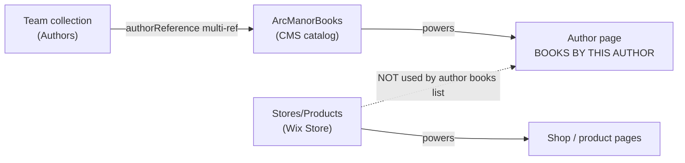

# Arc Manor Books — Author ↔ Book Link Diagnosis

**Site:** [https://www.arcmanorbooks.com/](https://www.arcmanorbooks.com/)  
**Stack:** Wix + Velo / Wix Data  
**Date:** 2026-08-03  
**Issue:** Authors and books still list, but assigning a book to an author so it shows under that author is broken after the redesign.

---

## Verdict

The store and author bios still work. What is broken is the **CMS multi-reference** that powers **“BOOKS BY THIS AUTHOR”** on author pages.

Author pages do **not** read Wix Store products directly. They load:

1. Author bio from collection **`Team`**
2. Books from custom collection **`ArcManorBooks`**
3. Joined by multi-reference **`authorReference`** → `Team`  
   (reciprocal field: `Team.ArcManorBooks`)

When that reference is empty, the books repeater renders nothing — even if the book still sells in the shop.

---

## How the site is wired



| Piece | Collection / field | Role |
|-------|--------------------|------|
| Author profile | `Team` | Dynamic `/author/{slug}` pages |
| Books under author | `ArcManorBooks.authorReference` → `Team` | “BOOKS BY THIS AUTHOR” repeater |
| Ecommerce catalog | `Stores/Products` | Shop, cart, product pages |
| Legacy URL field | `booksByThisAuthor` (URL) | Old-style author URL on book rows; still present on working records |
| Alternate refs | `Team.storeReference`, `caezikProducts`, `phoenixPickProducts` | Related imprint/store linking; not what currently fills most author book lists |

---

## Proof (live examples)

### Empty author pages (bio OK, books = 0)

| Author | Page | Store reality |
|--------|------|----------------|
| Keith Laumer | [/author/keith-laumer](https://www.arcmanorbooks.com/author/keith-laumer) | [Bolo](https://www.arcmanorbooks.com/product-page/bolo-caezik-notables) exists in store, not on author page |
| Lezli Robyn | [/author/lezli-robyn](https://www.arcmanorbooks.com/author/lezli-robyn) | Co-author on titles that appear only under other authors |
| Charles E. Gannon | [/author/charles-e.-gannon](https://www.arcmanorbooks.com/author/charles-e.-gannon) | Empty books section |
| Katharine Kerr | [/author/katharine-kerr](https://www.arcmanorbooks.com/author/katharine-kerr) | Empty books section |
| Doug Dandridge | [/author/doug-dandridge](https://www.arcmanorbooks.com/author/doug-dandridge) | Empty books section |

Page payload for those authors includes:

```text
"ArcManorBooks":{}
```

### Co-author only half-linked

- [When Parallel Lines Meet](https://www.arcmanorbooks.com/product-page/when-parallel-lines-meet) shows under [Mike Resnick](https://www.arcmanorbooks.com/author/mike-resnick)
- Same title does **not** show under [Lezli Robyn](https://www.arcmanorbooks.com/author/lezli-robyn)
- Meaning: `authorReference` is set for Resnick only

### Product-page links ≠ CMS references

- [Soulmates](https://www.arcmanorbooks.com/product-page/soulmates) has author URLs for Resnick and Robyn on the product page
- That does **not** populate `ArcManorBooks.authorReference`, so it still won’t appear under “BOOKS BY THIS AUTHOR”

### Working control case

- [Nancy Kress](https://www.arcmanorbooks.com/author/nancy-kress) still shows multiple books
- Those `ArcManorBooks` rows have author linkage / `booksByThisAuthor` URL filled

---

## Secondary issue: messy author slugs

After redesign/migration, author URLs are inconsistent:

| Style | Example | Notes |
|-------|---------|--------|
| Clean slug | `/author/nancy-kress` | Preferred |
| Comma-encoded “Last, First” | `/author/london%2C-jack`, `/author/brozek%2C-jennifer` | Present in listing + sitemap; fragile |
| Incomplete slug | `/author/brozek`, `/author/dietz` | 404 |

If any filter or Velo code still matches on `booksByThisAuthor` URL equality, slug drift alone can drop books from author pages.

---

## Root cause (most likely)

During the redesign, author pages stayed bound to **`ArcManorBooks` + `authorReference`**, while day-to-day book work moved toward **Wix Store products** and/or manual author URL text on product pages.

Result:

1. Store products can exist without a linked `ArcManorBooks` row  
2. Or the row exists but **`authorReference` was never set / was lost**  
3. Co-authors are often missing from the multi-reference  
4. Legacy URL field `booksByThisAuthor` was not fully backfilled to the new reference model

So the “link between authors and books” the client describes is this CMS relationship — not a random frontend CSS bug.

---

## Fix plan (Wix Editor / CMS)

1. Open CMS → **`ArcManorBooks`** (also check `caezikProducts` / `phoenixPickProducts` if imprint pages use them).
2. For each book that should appear under an author, set **Author Reference** (`authorReference`) to the correct **`Team`** item(s), including co-authors.
3. Confirm author dynamic page dataset / Velo still queries via that reference (or `queryReferenced`), not Store-only.
4. Decide one source of truth:
   - Prefer **`authorReference` multi-ref**, or
   - Rebuild author books from `Team.storeReference` → `Stores/Products` and retire duplicate CMS catalog
5. Normalize author URL slugs to one pattern (`firstname-lastname`) and update any leftover `booksByThisAuthor` URLs.
6. Spot-check empty authors above after publish.

### Quick acceptance checks

- [ ] Laumer → Bolo appears under author  
- [ ] Robyn → co-authored titles appear (Parallel Lines, Soulmates if in CMS)  
- [ ] Gannon / Kerr / Dandridge either show books or are intentionally empty  
- [ ] New book: set `authorReference` once → appears on author page without manual URL hacks  

---

## What this is / isn’t

| Is | Isn’t |
|----|-------|
| Broken CMS author↔book multi-reference after redesign | Total site outage |
| Store and author lists can both look “fine” while the join is empty | Pure Velo syntax crash (pages still render) |
| Fixable in CMS + dataset binding | Requires rebuilding the whole site |

---

## Suggested client message (short)

> Authors and books still exist as separate lists. The connection that was supposed to attach books to authors on each author page (`ArcManorBooks.authorReference` → `Team`) is missing or incomplete after the redesign. The Wix Store catalog still sells titles, but author pages read a different CMS collection, so store-only / URL-only assignments never show under “BOOKS BY THIS AUTHOR.” Fix is to restore those multi-references (and optionally unify on one catalog), then normalize author URL slugs.
