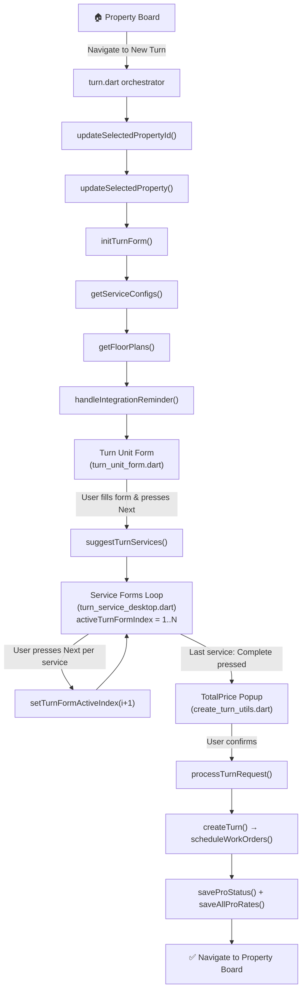
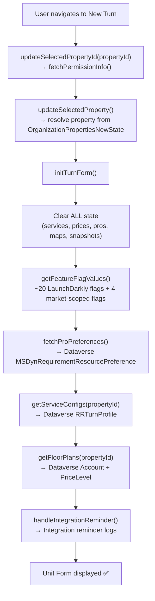
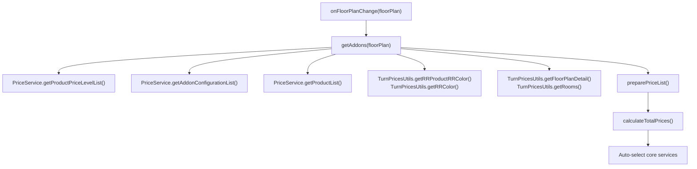
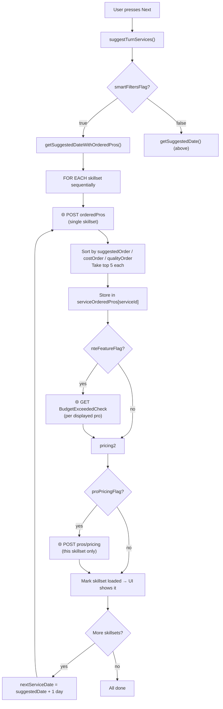
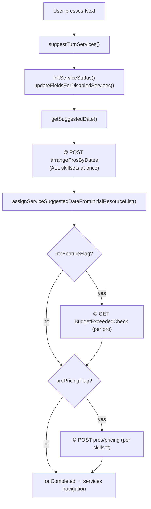
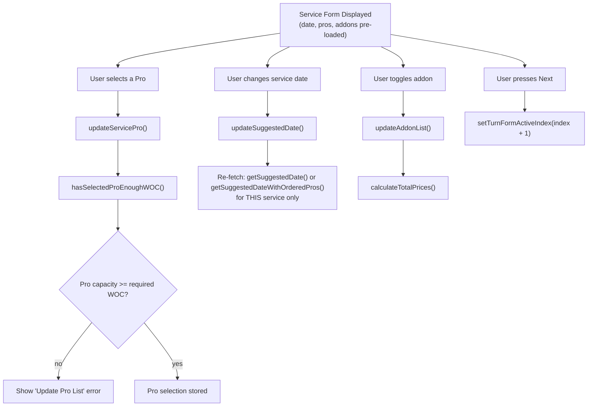
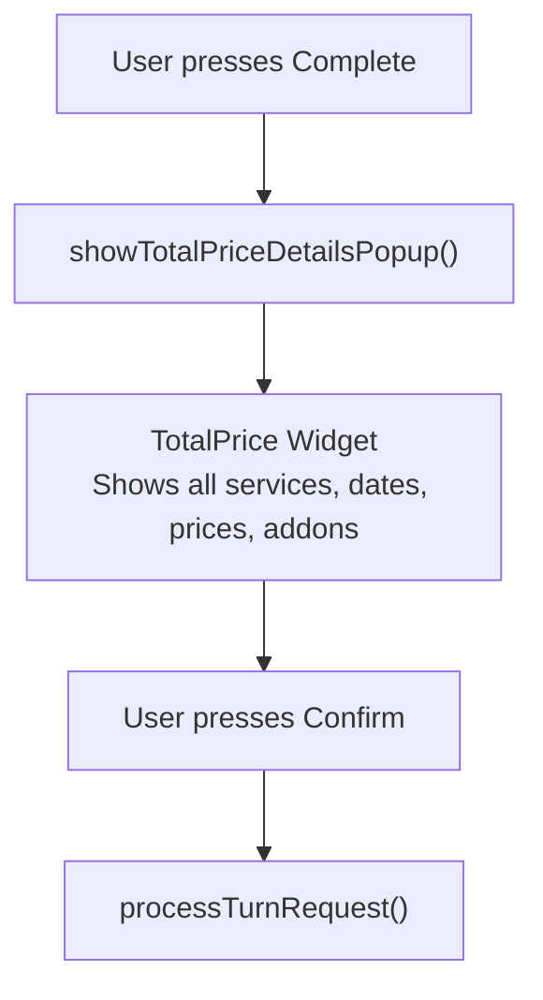
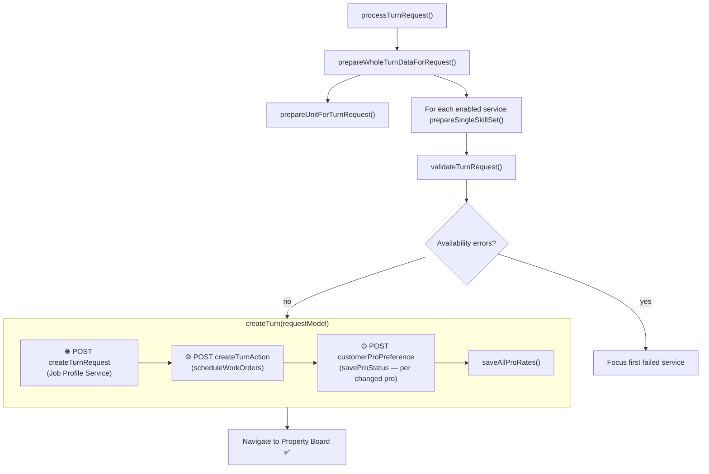
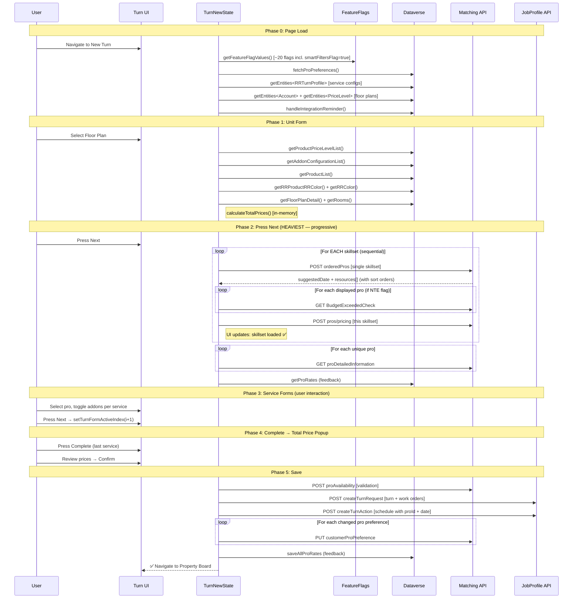

# New Turn Creation Flow — Full Data & Request Map

> **Branch:** `tech/43731/ep_connection_ordered_pros_new_turn`
> **Scope:** New Turn only (not Edit Turn). `smartFiltersFlagKey` = **true**, all other FFs open.
> **Goal:** Map every API request, its trigger, its data, and where it's consumed.
> **Key files:** `turn.dart` (orchestrator) → `turn_new_state.dart` (state) → `turn_unit_form.dart` (step 1) → `turn_service_desktop.dart` (step 2..N) → `create_turn_utils.dart` (save)

---

## High-Level Flow Overview



### Navigation Model (`activeTurnFormIndex`)

```
Index 0  → Turn Unit Form (unit name, floor plan, move-out, PO)
Index 1  → Service 1 (e.g. Painting)
Index 2  → Service 2 (e.g. Cleaning)
Index N  → Service N (last service shows "Complete" instead of "Next")

Desktop: TurnFormDesktop splits left sidebar (service list) + right panel (active form)
Mobile:  TurnFormMobile uses sliding panel controlled by panelController
```

---

## Phase 0: Page Load & Initialization

**Trigger:** User navigates to New Turn page.
**Orchestrator:** `turn.dart` → calls methods on `TurnNewState` (extends `GetxController`, implements `RRTurn`)
**File:** `turn.dart` (parent), `turn_new_state.dart` (state)

The **Turn page** (`turn.dart`) runs this sequence on first frame:



### Requests in Phase 0

| # | Method | API / Source | Data Returned | Stored In |
|---|--------|-------------|---------------|-----------|
| 0 | `fetchPermissionInfo()` | `IBookingAlertRepository.getApprovalPin()` (conditional: only if addon approval pins FF enabled) | Approval pin info | `approvalPin` |
| 1 | `getFeatureFlagValues()` | LaunchDarkly (`FeatureFlagService`) + `FeatureFlagServiceRepository` (market-scoped) | Boolean flags: `proDetailsFeatureFlag`, `proPricingFlag`, `nteFeatureFlag`, `costRankingFlag`, `smartFiltersFlag`, `marketPlaceProductFlag`, `townHomeWOCCapacityFlag`, `inspectionFlag`, `inspectionV4Flag`, `allowEditPendingJobsFlag`, `integrationReminderFlag`, `backgroundPhotoUploadFlag`, `downloadReportFlag`, `fixedValueAddonRequestedMoreThanOneFlag`, `downloadPostMoveOutInspectionReportFlag` | Individual flag fields on state |
| 2 | `fetchProPreferences()` | `dataRepositoryService.getEntities<MSDynRequirementResourcePreference>` → Dataverse | Pro preference list (favorite/restricted/neutral per property) | `proPreferences` |
| 3 | `getServiceConfigs()` | `dataRepositoryService.getEntities<RRTurnProfile>` → Dataverse (cached) | Turn profile list (Painting, Cleaning, Flooring, etc.) with vendor, order, config | `services` (as `TurnServiceModel` list), `updatedRRTurnProfile` |
| 4 | `getFloorPlans()` | `dataRepositoryService.getEntities<Account>` + `getEntities<PriceLevel>` → Dataverse | Property account details + floor plan/price level list | `property`, `floorPlans` |
| 5 | `handleIntegrationReminder()` | `IIntegrationReminderLogsRepository` → integration reminder logs | Survey display decision | UI-only |

---

## Phase 1: Turn Unit Form (`turn_unit_form.dart`)

User fills: **Unit Name**, **Floor Plan**, **Move-Out Date**, optionally **PO Number**.

By the time the user sees the form, Phase 0 has already loaded `services`, `floorPlans`, and `proPreferences`. The form widget (`TurnUnitForm`) only runs `_setupControllers()` and `_setupListeners()` in `initState` — **no API calls** from the widget itself.

### Step 1a: User Selects Floor Plan → `onFloorPlanChange()`

**Trigger:** Floor plan dropdown selection.



| # | Method | API / Source | Data Returned | Stored In |
|---|--------|-------------|---------------|-----------|
| 6 | `PriceService().getProductPriceLevelList()` | `dataRepositoryService` → Dataverse | Product price levels for this floor plan | `productPriceLevels` |
| 7 | `PriceService().getAddonConfigurationList()` | `dataRepositoryService` → Dataverse | Addon configuration rules | local var |
| 8 | `PriceService().getProductList()` | `dataRepositoryService` → Dataverse | Products (addons) + materials | `products` |
| 9 | `TurnPricesUtils.getRRProductRRColor()` | `dataRepositoryService` → Dataverse | Product-color mappings | `productsAndColors` |
| 10 | `TurnPricesUtils.getRRColor()` | `dataRepositoryService` → Dataverse | Color entities | merged into `productsAndColors` |
| 11 | `TurnPricesUtils.getFloorPlanDetail()` | `dataRepositoryService` → Dataverse | Floor plan detail (room data) | local var |
| 12 | `TurnPricesUtils.getRooms()` | `dataRepositoryService` → Dataverse | Rooms list | `rooms` |
| 13 | `preparePriceListForTurn()` | In-memory computation + optional `MSDynUnit` fetch | Grouped products by skillset, addon prices, repair products | `groupedProduct`, `addonPrices`, `repairProducts` |
| 14 | `refetchProsPricingOnFloorplanChange()` | `/matching/1.5/.../pros/pricing` (only if `proPricingFlag` AND `proCorePrices` non-empty) | Updated pro pricing for new floor plan | `proCorePrices`, `proPricingProducts` |

**Total Dataverse calls in onFloorPlanChange: ~7 entity fetches + conditional pricing re-fetch**

After `getAddons()`, also runs:
- `updateUnitDiscrepancyAddons()` — marks unit discrepancy addons
- `updateTrashOutAddons()` — marks trash-out addons
- `calculateTotalPrices()` — auto-selects core service addons for new turns

---

## Phase 2: User Presses "Next" → `suggestTurnServices()`

**Trigger:** Next button on Turn Unit Form (enabled only when `validateUnitForm()` is true — unit name, floor plan, move-out all set, PO rules satisfied).
**File:** `turn_new_state.dart` → `suggestTurnServices()`
**Key:** This is the **MAIN DATA FETCH** for pro/date suggestions — the heaviest phase.

The button calls `await suggestTurnServices()` then `clearNextAvailableData()`.

### Primary Flow (smartFiltersFlag = true — this branch)



| # | Method | API Endpoint | HTTP | Request Body | Data Returned | Stored In |
|---|--------|-------------|------|-------------|---------------|-----------|
| 15 | `getOrderedPros()` (per skillset) | `/matching/1.5/properties/{propId}/floorplans/{fpId}/orderedPros` | POST | `{ serviceDate: "...", skillset: "...", workOrderServices: [...] }` | `{ data: { skillset, suggestedDate, resources[], emptyListReason } }` | `serviceOrderedPros[serviceId]` → `OrderedProsData` (3 sorted lists: suggested, cost, quality) |
| 16 | `getBudgetExceedCheck()` (per displayed pro) | `/matching/1.5/properties/{propId}/pros/{proId}/BudgetExceededCheck` | GET | — | List of exceeded skillset names `["Painting"]` | `proExceededSkillsets[proId]` |
| 17 | `getProsPricing()` (per skillset) | `/matching/1.5/properties/{propId}/floorplans/{fpId}/pros/pricing` | POST | `{ skillset, proIds[] }` | Pro pricing products per pro | `proPricingProducts[skillset][proId]` → `proCorePrices` |
| 17b | `getProsPricing()` (Repair — painting only) | Same endpoint | POST | `{ skillset: "Repair", proIds[] }` | Repair addon pricing | merged into `proPricingProducts` |
| 18 | `selectedProInformationFetch()` | `getProDetailedInformation()` → `/matching/1.5/pros/{proId}` | GET | — | BookableResource (pro BRB data), last completed WO, quality checks | `bookableResources`, `selectedQuantitativeBrbList` |
| 19 | `getProRates()` | `dataRepositoryService` → Dataverse (RRProFeedback entities) | — | Pro feedback scores | `rrProFeedbacks` |

**Key behavior with smart filters:**
- `unawaited()` — the function returns immediately, UI shows progressive loading per skillset
- `onSkillsetCompleted` callback fires after each skillset → `updateSelectedQuantitativeProListWithUniquePros()` + `update()`
- `serviceSkillsetLoaded` tracks which service config IDs have finished loading
- `serviceSkillsetRequested` tracks which have been requested
- UI in `turn_service_desktop.dart` shows `PreLoader` while skillset not yet loaded

**Key difference from legacy:** Sequential per-skillset instead of all-at-once. UI updates progressively. Each skillset gets its own budget check + pricing calls before moving to the next.

### Legacy Flow (smartFiltersFlag = false — old path, unchanged)



| # | Method | API Endpoint | HTTP | Details |
|---|--------|-------------|------|---------|
| 15-legacy | `getArrangeProsByDates()` | `/matching/1.5/.../arrangeProsByDates` | POST | Sends ALL skillsets at once, blocks until all return |

**Key insight (legacy):** Single blocking call for all skillsets. User waits for the slowest one. This is what the smart filters path replaces.

---

## Phase 3: Service Forms Loop (`turn_service_desktop.dart`)

For each enabled service (Painting, Cleaning, Flooring, etc.), user sees:
- **Suggested Date** (from Phase 2)
- **Pro List** (from Phase 2)
- **Addons** (from Phase 1b)
- **Vendor selection** (if applicable)

### Per-Service User Actions & Requests



| # | Trigger | Method | API Call? | Details |
|---|---------|--------|-----------|---------|
| 20 | Pro selected | `updateServicePro()` | No | Updates `service.selectedProId`, telemetry, clears availability error |
| 21 | Pro selected | `hasSelectedProEnoughWOC()` | No | Compares pro `remainingCapacity` vs sum of addon `rr_lucasbasenumber`. If over capacity → clears selection, shows "Update Pro List" error |
| 22 | Date changed | `updateSuggestedDate()` | **Yes** — `arrangeProsByDates` or `orderedPros` (smart filters) | Re-fetches pros for new date + optional budget/pricing |
| 23 | Addon toggled | `updateAddonList()` → `updateTurnAddonList()` | No (in-memory) | Recalculates prices via `TurnPricesUtils.reCalculateAddonPrice()`, then **re-checks WOC** via `hasSelectedProEnoughWOC()` |
| 24 | Vendor change to RR | `updateSuggestedDate()` | **Yes** — same as #22 | Fetch pros for the newly RR-vendor service |
| 25 | Pro favorite/restrict | `updateProStatus()` | No (deferred to save) | Stored in `proChangeStatus` map, applied at turn creation |
| 26 | Pro details tap | `fetchQuantitativeDataForSelectedPro()` → `getProDetailedInformation()` | **Yes** — GET `/matching/1.5/pros/{proId}` | Pro detailed info for popup (BookableResource, last WO, quality) |
| 27 | WOC exceeded → "Update Pro List" | `updateProListFromExtension()` → `getSuggestedPro()` | **Yes** — POST `/matching/1.5/.../suggestedPros` | Refreshes pros when scope changes invalidate current selection |

### Smart Filters UI Behavior (smartFiltersFlag = true)

When `smartFiltersFlag = true` and the service vendor is **Rent Ready**:
- **`ProSmartFiltersController`** serves real ordered data (3 sorted lists) from `serviceOrderedPros`
- Smart filter tabs (Suggested / Lowest Cost / Highest Quality) toggle the active sort
- Max 5 pros displayed per filter tab
- `PreLoader` shown while `serviceSkillsetLoaded` doesn't contain the current service config ID
- If vendor is **NOT** Rent Ready → `TurnServicePros` is hidden entirely (no pro selection needed)

### Navigation Between Services

```
activeTurnFormIndex: 0 = Unit Form, 1 = Service 1, 2 = Service 2, ...
setTurnFormActiveIndex(index) → increments index → shows next service form
Last service shows "Complete" button instead of "Next"
```

---

## Phase 4: Complete Button → Total Price Popup

**Trigger:** User presses "Complete" on last service.
**File:** `create_turn_utils.dart` → `showTotalPriceDetailsPopup()`



**No API calls in popup display** — uses pre-computed:
- `services` (with selected pros and dates)
- `totalPrices`
- `groupedProduct` / `repairProducts`
- `addonPrices`
- `proPricingProducts`

---

## Phase 5: Save Turn (`processTurnRequest` → `createTurn`)

**Trigger:** User confirms in Total Price popup.
**File:** `turn_new_state.dart`



### Request Preparation

`prepareWholeTurnDataForRequest()` builds the full request model:
1. `prepareUnitForTurnRequest()` → fills moveIn/moveOut/readyBy dates, floorPlanId, customerPO, unit name, notes
2. For each RR-enabled service → `prepareSingleSkillSet()`:
   - `prepareCoreAddonForTurnRequest()` — core service WO services
   - `prepareAddonsForTurnRequest()` — selected addon WO services with product IDs, rooms, materials, colors, PO
   - `createSkillSetModel()` — skillset name, vendorType, startDate, metadata (originalProMatchDate for new turns)
   - Service photos → `uploadedAttachments`

**Note:** The selected **pro ID** is NOT part of `TurnRequestModel`. It's sent separately via `createTurnAction` (booking action) after the turn is created.

### Validation Request

| # | Method | API Endpoint | HTTP | Details |
|---|--------|-------------|------|---------|
| 28 | `validateTurnRequest()` | POST `/matching/1.5/properties/{propId}/floorplans/{fpId}/proAvailability` | POST | Checks if each selected pro is available on the chosen date. If validation fails → `focusFirstFailedService()` and abort |

### Save Requests (Sequential)

| # | Method | API Endpoint | HTTP | Request Body | Purpose |
|---|--------|-------------|------|-------------|---------|
| 29 | `createTurnRequest()` | POST `/turns/1.5/properties/{propId}/turns?return=full` | POST | Full `TurnRequestModel.toJson()` (unit info, skillsets with dates/addons/PO — **not** pro IDs) | Creates the turn + work orders in CRM |
| 30 | `scheduleWorkOrders()` → `createTurnAction()` | POST `/turns/1.0/properties/{propId}/turns/{jobProfileId}/actions` | POST | Array of `{ workOrderId, date, proId, action: "booking", overBudgetReason? }` | Schedules each work order with selected pro on selected date |
| 31 | `saveProStatus()` → `customerProPreference()` | PUT `/matching/1.5/properties/{propId}/pros/{proId}/preference` | PUT | `{ preference: "matched"/"restricted"/"neutral", reason? }` | Saves user's pro favorite/restrict choices |
| 32 | `saveAllProRates()` | `propertiesService.postProFeedback()` | POST | Pro rate feedback data | Saves pro rating feedback |
| — | Telemetry | `TelemetryService` → `TurnCreationSuccess` event | — | propertyId, turnId, services, booking alerts | Analytics tracking |

---

## Complete Request Map (Chronological — smartFiltersFlag = true)



---

## Data Source Summary

| Source | Requests | Phase | Blocking? |
|--------|----------|-------|-----------|
| **Feature Flag Service** (LaunchDarkly) | 1 batch (~20 flags) | Phase 0 | Yes (init) |
| **Dataverse** (via `dataRepositoryService`) | ~5 entity fetches | Phase 0 (init) | Yes |
| **Dataverse** (via `PriceService` + `TurnPricesUtils`) | ~7 entity fetches | Phase 1 (floor plan) | Yes |
| **Matching API** (`orderedPros`) — smart filters | S calls (1 per skillset, sequential) | Phase 2 | Progressive (non-blocking per skillset) |
| **Matching API** (`arrangeProsByDates`) — legacy | 1 call (all skillsets) | Phase 2 | **Yes — blocks all at once** |
| **Matching API** (`BudgetExceededCheck`) | N calls (per displayed pro per skillset) | Phase 2 | Sequential within each skillset |
| **Matching API** (`pros/pricing`) | M calls (per skillset) | Phase 2 | 1 per skillset (sequential in smart filters) |
| **Matching API** (`proDetailedInformation`) | K calls (per unique pro) | Phase 2 post | Sequential |
| **Dataverse** (`RRProFeedback`) | 1 batch | Phase 2 post | Yes |
| **Matching API** (`proAvailability`) | 1 call | Phase 5 | Yes |
| **Job Profile API** (`createTurnRequest`) | 1 call | Phase 5 | Yes |
| **Job Profile API** (`createTurnAction`) | 1 call | Phase 5 | Yes |
| **Matching API** (`customerProPreference`) | P calls (per changed pro) | Phase 5 post | Sequential |
| **Properties Service** (`postProFeedback`) | 1 call | Phase 5 post | Yes |

---

## Key State Fields Reference

| Field | Type | Set By | Used By |
|-------|------|--------|---------|
| `services` | `RxList<TurnServiceModel>` | `getServiceConfigs()` | Everywhere — the service list |
| `serviceSuggestedDateWithPros` | `Map<String, DateWithPros>` | `arrangeProsByDates` response | Date pickers, pro lists, scheduling |
| `serviceOrderedPros` | `Map<String, OrderedProsData>` | `orderedPros` response (smart filters) | Smart filter tabs |
| `groupedProduct` | `Map<RRSkillSet, List<WorkOrderServiceModel>>` | `preparePriceList()` | Addons UI, price calculation |
| `addonPrices` | `Map<String, AddonPricing>` | `preparePriceList()` | Addon price display |
| `totalPrices` | `RxMap<String, double>` | `calculateTotalPrices()` | Total price popup |
| `proCorePrices` | `Map` | `getProsPricing()` | Core price display on pro cards |
| `proExceededSkillsets` | `Map<String, List<String>>` | `getBudgetExceedCheck()` | NTE badges on pro cards |
| `proPricingProducts` | `Map<String, Map<String, List<ProsPricingProduct>>>` | `getProsPricing()` | Dynamic addon prices |
| `bookableResources` | `List<BookableResource>` | `getProDetailedInformation()` | Pro details popup |
| `proChangeStatus` | `Map<String, CustomerProPreferenceEnum>` | User actions (fav/restrict) | Saved at end |
| `proPreferences` | `RxList<MSDynRequirementResourcePreference>` | `fetchProPreferences()` | Pro card badges |
| `requestModel` | `TurnRequestModel` | `prepareWholeTurnDataForRequest()` | Final save API body |

---

## Matching API Endpoints Reference

All endpoints under base URL: `https://{env}api.rentready.com`

| Endpoint | HTTP | Used In | Purpose |
|----------|------|---------|---------|
| `/matching/1.5/properties/{propId}/floorplans/{fpId}/arrangeProsByDates` | POST | `getSuggestedDate()` (legacy) | Fetch suggested dates + pros for ALL skillsets at once |
| `/matching/1.5/properties/{propId}/floorplans/{fpId}/orderedPros` | POST | `getSuggestedDateWithOrderedPros()` (smart filters) | Fetch ordered pros for SINGLE skillset with sort orders |
| `/matching/1.5/properties/{propId}/floorplans/{fpId}/pros/pricing` | POST | `getProsPricing()` | Batch pricing for pros by skillset |
| `/matching/1.5/properties/{propId}/pros/{proId}/pricing` | GET | `getFullProPricing()` (pro details page only) | Full pricing for a single pro |
| `/matching/1.5/properties/{propId}/pros/{proId}/BudgetExceededCheck` | GET | `getBudgetExceedCheck()` | NTE budget threshold check per pro |
| `/matching/1.5/properties/{propId}/floorplans/{fpId}/proAvailability` | POST | `validateTurnRequest()` | Pre-save availability validation |
| `/matching/1.5/properties/{propId}/floorplans/{fpId}/suggestedPros` | POST | `getSuggestedPro()` | Refresh pros after WOC scope change |
| `/matching/1.5/properties/{propId}/floorplans/{fpId}/pros/preferred/nearestAvailableDate` | POST | `getNearestAvailableDate()` | Find next available date for a preferred pro |
| `/matching/1.5/pros/{proId}` | GET | `getProDetailedInformation()` | Pro BRB details for popup |
| `/matching/1.5/properties/{propId}/pros/{proId}/preference` | PUT/DELETE | `customerProPreference()` | Save/remove pro favorite/restrict |

---

## Potential Bottlenecks & Optimization Opportunities

| Bottleneck | Phase | Impact | Current Mitigation | Further Optimization |
|------------|-------|--------|-------------------|---------------------|
| `arrangeProsByDates` blocks for ALL skillsets | Phase 2 (legacy) | User waits for slowest skillset | **Smart filters** (`orderedPros`) makes this sequential + progressive | Fully replace legacy path |
| `orderedPros` sequential loop | Phase 2 (smart filters) | Total time = sum of all skillsets | Progressive UI loading per skillset | Parallelize independent skillsets |
| `BudgetExceededCheck` per pro (sequential) | Phase 2 | N network calls per skillset | Runs within each skillset's block | Batch API endpoint |
| `proDetailedInformation` per unique pro | Phase 2 post | K network calls | Runs after all skillsets done | Batch endpoint or lazy-load on tap |
| `onFloorPlanChange` → ~7 Dataverse calls | Phase 1 | Floor plan selection feels slow | Some calls use cache | Combine into single aggregate query |
| `proAvailability` validation at save time | Phase 5 | Extra round-trip before save | — | Validate during service form navigation |
| `customerProPreference` per changed pro | Phase 5 post | P sequential calls | Only for changed preferences | Batch endpoint |
| Phase 0 loads (~5 Dataverse + FF calls) | Phase 0 | Initial page load delay | FF service may cache | Parallelize init calls |
