# Thermal thesis — full research walkthrough

**Audience:** you (the student). This is a study document, not an advisor email and not a paper draft.  
**Workspace:** `thermal_thesis_audit_workspace`  
**Experimental status:** closed. Final operating point: **M1-R-CE**.  
**Rule used while writing:** every number is copied from an existing local report. If two reports give related but different quantities (for example a pooled point estimate vs a bootstrap mean), both are shown and labelled. Nothing was retrained.

How to use this file:

1. Read Part 1 once for the mental model.
2. Walk Part 2 in order. That is the actual research process.
3. Use Parts 3–10 when you need to *explain* a specific decision (leakage, ROI, models, metrics, results).
4. Use Part 11 before you speak to Ahmet Hoca, so you do not over-claim.
5. Use Part 13 as the spoken 5-minute version.

---


<a id="top"></a>

## Clickable index

Use the sticky pills, or jump here:

| Area | Jump |
|---|---|
| Figure index | [Figures](#figures) |
| Part 1 Executive overview | [Part 1](#part-1) |
| Part 2 Timeline | [Part 2](#part-2) |
| Part 3 Dataset | [Part 3](#part-3) |
| Part 4 Leakage | [Part 4](#part-4) |
| Part 5 ROI | [Part 5](#part-5) |
| Part 6 Models | [Part 6](#part-6) |
| Part 7 Metrics | [Part 7](#part-7) |
| Part 8 Experiment evolution | [Part 8](#part-8) |
| Part 9 Results | [Part 9](#part-9) |
| Part 10 Why M1-R-CE won | [Part 10](#part-10) |
| Part 11 Claims | [Part 11](#part-11) |
| Part 12 File map | [Part 12](#part-12) |
| Part 13 5-minute talk | [Part 13](#part-13) |
| Appendix | [Appendix](#appendix) |

---
<a id="figures"></a>
## Figure index

| File | What it teaches |
| --- | --- |
| `thesis-assets/fig01_dataset_counts_and_subset.png` | RAW vs FILTERED counts; FILTERED is a subset of files |
| `thesis-assets/fig02_images_and_sessions_per_subject.png` | Images and sessions per subject |
| `thesis-assets/fig03_effective_independent_samples.png` | Near-duplicate collapsing |
| `thesis-assets/fig04_session_leakage_bad_vs_good.png` | Why random splits leak |
| `thesis-assets/fig05_subject_disjoint_folds.png` | Adaptation 5-fold rule |
| `thesis-assets/fig06_roi_original_manual_fixed_yunet.png` | Original / manual box / fixed crop / YuNet |
| `thesis-assets/fig07_roi_validation_metrics.png` | Why the geometric crop won |
| `thesis-assets/fig08_m1r_ce_inference_pipeline.png` | Final M1-R-CE inference path |
| `thesis-assets/fig09_verification_identification_and_roc_axes.png` | Metric vocabulary |
| `thesis-assets/fig10_filtered_oof_roc_frozen_vs_m1r.png` | Real FILTERED OOF ROC |
| `thesis-assets/fig11_experiment_evolution.png` | What changed on each arrow |
| `thesis-assets/fig12_adaptation_oof_auc_grouped.png` | Adapter AUC bars |
| `thesis-assets/fig13_adaptation_oof_eer_grouped.png` | Adapter EER bars |
| `thesis-assets/fig14_paired_delta_auc_forest.png` | Supported vs unsupported ΔAUC |
| `thesis-assets/fig15_protocol_v2_baseline_auc.png` | LBPH / Frozen / SFace |
| `thesis-assets/fig16_trainable_parameters.png` | Why M1 stays lightweight |
| `thesis-assets/fig17_subject_alias_005341.png` | `005341` → `005340` |
| `thesis-assets/asset_contact_sheet_*.png` | Existing 36-subject contact sheets (copied, not redrawn) |
| `thesis-assets/asset_yunet_*` / `asset_haar_*` | Existing detector previews (copied) |

Figures were generated from locked CSVs/reports by `thesis-assets/build_walkthrough_figures.py`. Source images were read, not modified.

---

<a id="part-1"></a>
# Part 1 — Executive overview

## What problem are we solving?

We have a **small thermal-face collection** and a thesis question that is *methodological*, not “beat the state of the art”:

> After we stop the dataset from cheating (near-duplicates, same-session copies, identity overlap), can a **frozen** ImageNet MobileNetV2 plus a **small trainable projection** improve matching of **people the adapter never trained on**?

The intended claim is: on this corpus, a leakage-safe protocol plus a lightweight adapter is a **supported improvement over frozen features**. It is **not** a claim that we built an operational biometric system.

## What is thermal face verification?

**Face verification** (1:1) answers: *are these two images the same person?*  
You score a pair. Same-person pairs are **genuine**. Different-person pairs are **impostor**. From those scores you draw a ROC curve.

**Face identification** (1:N) answers: *which enrolled identity is this probe?*  
You rank gallery templates. **Rank-1** means the true person was the nearest template.

**Thermal** means the camera records heat, not ordinary colour. Faces look like smooth grey blobs. Clothing, neck, and torso are often brighter or larger than the face. Visible-light face models (YuNet, SFace) were trained on a different physical signal, so they may fail even if they are famous on RGB photos.

## What data did we receive?

Two local folders, copied non-destructively:

| | RAW | FILTERED |
| --- | ---: | ---: |
| Images | **1198** | **549** |
| Subject folders | **63** | **62** |
| Resolution | 480×480 | 480×480 |
| Mode | grayscale JPEG (`L`) | grayscale JPEG (`L`) |

**Source:** `reports/audit_summary.md`, `reports/image_technical_summary.csv`, `reports/copy_verification.md`.

Original source paths recorded in copy verification (historical Downloads locations):

- RAW source: `iris_izinli_veri_Temps_Extract_2`
- FILTERED source: `Thesis_Images`

Local files do **not** include a dataset card, README, or citation that would identify a named public benchmark. **Do not infer provenance or ethics approval from the files.**

## What was wrong / risky about immediately training a model?

Four structural problems, all found *before* any recognizer was trained:

1. **FILTERED is not an enhanced image.** Matched RAW/FILTERED files are the same pixels. Training “on FILTERED because it looks cleaner” would have been a misunderstanding of the data.
2. **Burst near-duplicates.** Filenames encode timestamps. A random image split can put almost-identical frames on both sides of train/test or into a genuine pair. That inflates accuracy.
3. **Folder-label typo.** All 13 FILTERED files under `005341` are exact hashes of RAW `005340`. Treating them as two people would have corrupted every subject-level experiment.
4. **The face is a small part of a 480×480 bust shot.** A full-frame descriptor can latch onto torso, clothes, camera distance, and background — identity leakage that is not “face recognition”.

## What is the final method?

**M1-R-CE**

- Official ImageNet MobileNetV2, **backbone frozen** (eval mode, including BatchNorm)
- Thermal ROI → grayscale replicated to 3 channels → 1280-d feature
- Trainable **128-d adapter** (Linear 1280→128, no bias, BatchNorm1d, L2)
- **164,096** adapter parameters at inference
- Trained on **RAW near-duplicate-cluster representatives** with **cross-entropy** on train identities
- Identity classifier **discarded** at test time
- Compare two images with **cosine similarity** on 128-d vectors

## What is the strongest result?

On the **subject-disjoint** adaptation protocol (unseen test identities, pooled out-of-fold):

| | FILTERED | RAW |
| --- | ---: | ---: |
| M1-R-CE ROC-AUC | **0.7882** | **0.7233** |
| Frozen MobileNetV2 ROC-AUC (same folds) | 0.6722 | 0.6309 |
| M1-R-CE EER | 0.2962 | 0.3285 |

Paired subject bootstrap (1000 iterations, seed 42): M1-R versus Frozen **ΔAUC CIs exclude 0 on both FILTERED and RAW**. That is the supported gain.

Residual EER is still high. TAR @ FAR=1% is 0.1436 FILTERED / 0.0897 RAW. This is a **controlled improvement**, not operational performance.

**Source:** `THESIS_RESULTS_LOCK.md` §E.3 and §F; `reports/m1r_adapter/m1r_vs_m1f_vs_frozen_summary.md`.

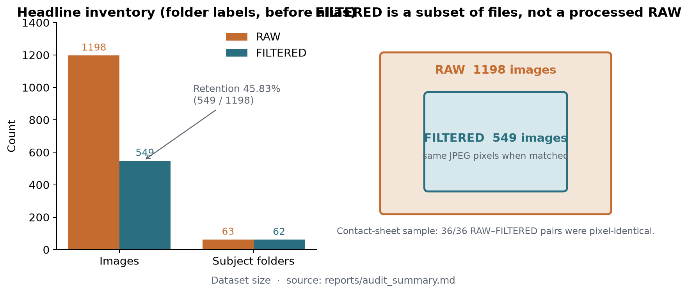

**Figure 1.** Headline counts and the subset relationship.  
**Source:** `reports/audit_summary.md`. **Ambiguity flag:** FILTERED is *almost* a subset: 545/549 FILTERED images matched to RAW; 4 FILTERED images were left unmatched (same timestamps exist in RAW, those instance numbers are missing). The nested diagram is pedagogical; it does not hide those 4 files.

---

<a id="part-2"></a>
# Part 2 — Complete project timeline

Read this as a lab notebook. For every major step: question → action → why → failure mode if skipped → discovery → decision.

Chronology follows the timestamps on the locked reports (copy verification 2026-08-24 through ArcFace 2026-08-28). Scientific *logic* of the adapter ablations is also drawn in Part 8.

---

### Step 0 — Original RAW and FILTERED folders

1. **Question.** What did we actually receive?
2. **What we did.** Located two source trees (RAW clinical-style export; FILTERED thesis-images folder) and treated them as read-only.
3. **Why necessary.** You cannot audit or hash files you have already overwritten.
4. **If skipped.** Any later “FILTERED looks better” claim would be uncheckable, because you would not know whether pixels changed.
5. **Discovery.** Two parallel trees, different file counts, anonymous 6-digit folders, DICOM-UID-like JPEG names with embedded `YYYYMMDDHHMMSS` timestamps. All readable images 480×480 grayscale JPEG.
6. **Decision.** Copy first, never write back to the original disks.

**Source:** `reports/copy_verification.md`, `reports/image_technical_summary.csv`.

---

### Step 1 — Non-destructive workspace creation

1. **Question.** Can we work without touching the originals?
2. **What we did.** Created `thermal_thesis_audit_workspace` with `source_copies/raw` and `source_copies/filtered`, plus `scripts/`, `reports/`, `derived/`. Later migrated from Downloads into `StudioProjects/sdd` (copy verification PASS; results not regenerated).
3. **Why necessary.** Thesis evidence must be replayable. Hashes are the ground truth that the copy is the same dataset.
4. **If skipped.** Silent file drift: a later crop or JPEG re-save could be mistaken for “the original data”.
5. **Discovery.** RAW copy 1203 files (1198 images); FILTERED copy 612 files (549 images). Image SHA-256 **1198/1198** and **549/549** OK.
6. **Decision.** Research counts use **image** totals (1198 / 549), not the extra non-image files in the copy inventories.

**Source:** `reports/copy_verification.md`, `README.md`, `migration_verification.md`.

---

### Step 2 — File / hash audit

1. **Question.** Are the copies complete, readable, and internally consistent?
2. **What we did.** Ran `scripts/02_run_thermal_audit.py`: inventories, hashes, resolutions, subject folders, RAW↔FILTERED matching.
3. **Why necessary.** Matching tells you whether FILTERED is a processed derivative or a **kept subset**.
4. **If skipped.** You might train on FILTERED believing it was denoised, when it is the same JPEG.
5. **Discovery.**
   - Retention **45.83%** (549/1198)
   - Exact duplicate groups: **0**
   - Near-duplicate groups: **152**
   - FILTERED matched to RAW: **545**; ambiguous: **0**; unmatched: **4**
   - Match methods: identical relative path 531, unique filename 13, perceptual hash 1
6. **Decision.** Biggest named risk in the audit: **`duplicate_leakage`**. Do not choose a deep model until session/near-dup control exists.

**Source:** `reports/audit_summary.md`.

---

### Step 3 — Subject-folder analysis

1. **Question.** Are 6-digit folders usable as identity keys?
2. **What we did.** Counted RAW/FILTERED folders, images per subject, eligibility for ≥5 images on both sides.
3. **Why necessary.** Biometric experiments need a **person** unit, not a filename unit.
4. **If skipped.** You would mix folder-only identities, imbalanced classes, and possible rename typos into one “accuracy”.
5. **Discovery.**
   - RAW folders **63**, FILTERED **62**, common **61** (before alias)
   - FILTERED images/subject min/median/mean/max = **1 / 9.0 / 8.85 / 25**
   - Subjects with ≥5 filtered images: **53**
   - Common-subject eligibility ≥5 in both: **52**
   - Lost after filtering (folder view): `005340`, `007144`
   - FILTERED-only folder: `005341`
   - Folders are dataset-provided grouping keys, **not** externally verified person IDs
6. **Decision.** Treat folder IDs as anonymous analysis keys. Investigate `005340` vs `005341` before freezing a cohort.

**Source:** `reports/audit_summary.md`, `reports/subject_summary.csv`.

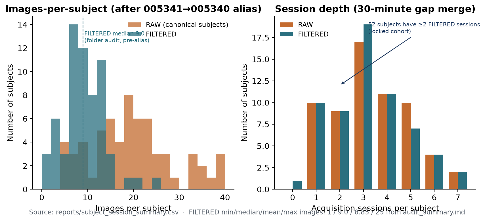

**Figure 2.** Distributions from `reports/subject_session_summary.csv`. The FILTERED median **9.0** quoted in `audit_summary.md` is the folder-level statistic on 62 FILTERED folders. After the alias, those 62 FILTERED counts are the same multiset (the 13 images move from folder `005341` to canonical `005340`).

---

### Step 4 — Alias `005341` → `005340`

1. **Question.** Is `005341` a new person or a renamed `005340`?
2. **What we did.** Compared SHA-256 of all 13 FILTERED `005341` files to RAW `005340` (same filenames).
3. **Why necessary.** Two labels for one identity would split genuine pairs and create fake impostors.
4. **If skipped.** Every protocol, fold, and metric that groups by folder ID would be wrong for that identity.
5. **Discovery.** Exact hash matches. Remaining RAW-only lost folder after remap: `007144` (4 images, no FILTERED subset).
6. **Decision.** **Analysis-only alias.** Source and copy files were **never renamed**. Canonical label `005341` is forbidden in frozen subject lists, protocols, and folds.

**Source:** `reports/audit_summary.md`.

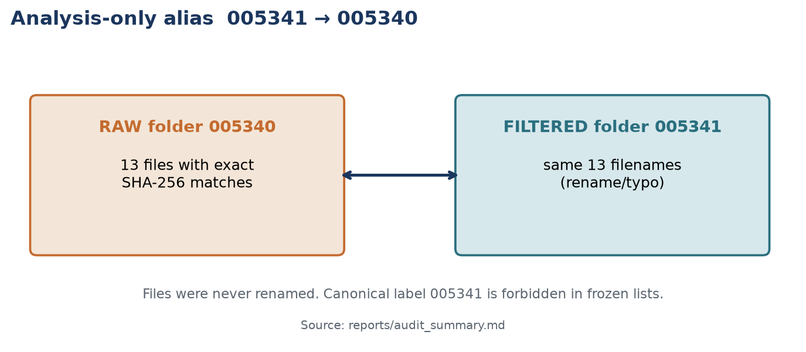

**Figure 3.** `005341` → `005340`. Source: `reports/audit_summary.md`.

---

### Step 5 — Duplicate analysis (exact)

1. **Question.** Are any two files byte-identical?
2. **What we did.** Grouped exact hashes inside the audit.
3. **Why necessary.** Exact copies in train and test are the crudest leakage.
4. **If skipped.** You could report perfect matches that are literally the same file.
5. **Discovery.** Exact duplicate groups: **0**.
6. **Decision.** Exact-copy leakage is not the main risk. Near-duplicates are.

**Source:** `reports/audit_summary.md`, `reports/exact_duplicate_groups.csv`.

---

### Step 6 — Near-duplicate analysis

1. **Question.** Are burst frames so similar that a split would cheat?
2. **What we did.** Perceptual-hash grouping in the file audit (152 groups). Later, a **within-subject** session audit with pHash Hamming ≤ 5, and a **cross-subject** similarity report (Hamming ≤ 4) that is **never merged**.
3. **Why necessary.** Thermal images are low-texture. Consecutive frames from one capture look almost the same to a matcher.
4. **If skipped.** Random splits produce near-copies on both sides → falsely optimistic AUC/Rank-1.
5. **Discovery.**
   - File-audit near-dup groups: **152**
   - Within-subject near-dup groups (session audit): **109**
   - Cross-subject similar pairs: **15** pairs across 15 subject-pairs (reported, not merged)
   - pHash can **over-cluster** low-texture thermal images (explicit caveat)
6. **Decision.** Prefer **session/timestamp-aware splits** over relying solely on hash groups. Collapse clusters so a cluster cannot sit on both sides of a split or a genuine pair.

**Source:** `reports/audit_summary.md`, `reports/session_audit_summary.md`, `reports/near_duplicate_groups.csv`.

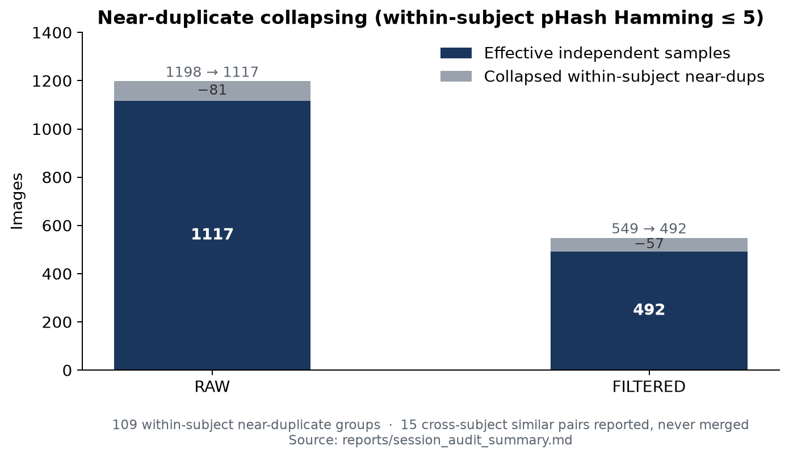

**Figure 4.** RAW 1198 → 1117; FILTERED 549 → 492. Source: `reports/session_audit_summary.md`.

---

### Step 7 — Session extraction

1. **Question.** What is a “visit” versus a burst?
2. **What we did.** Parsed timestamps from filenames. Merged adjacent timestamps within **30 minutes** into one session (`scripts/03_session_audit.py`).
3. **Why necessary.** Real recognition is “same person, different day/visit”, not “same person, next frame”.
4. **If skipped.** You would treat a 10-frame burst as 10 independent samples.
5. **Discovery.**
   - ≥2 RAW sessions: **53**; ≥3 RAW: **44**
   - ≥2 FILTERED sessions: **52**; ≥3 FILTERED: **43**
   - Subjects supporting strict session-separated train/test: **52**
   - Subjects with FILTERED images that cannot: **10** (mostly single FILTERED session)
6. **Decision.** Lock the **52-subject** multi-session cohort. Keep the 10 others out of the primary protocol (Protocol C was proposed only as an optimistic same-session upper bound and was **not** used as the primary claim).

**Source:** `reports/session_audit_summary.md`.

---

### Step 8 — Leakage risk (the reason the protocol exists)

1. **Question.** What would a naive sklearn `train_test_split` on images do here?
2. **What we did.** Wrote the leakage analysis into the session audit and later protocols: no same-session genuine pairs, no cluster split across gallery/probe, later no identity overlap in adaptation folds.
3. **Why necessary.** This is the difference between a defensible master’s experiment and a number you cannot defend in a thesis defense.
4. **If skipped.** High accuracy that measures “same burst” instead of “same person”.
5. **Discovery.** Leakage is not hypothetical: 109 within-subject near-dup groups exist. Cross-subject lookalikes exist but were not merged (merging different folder IDs would invent identity errors of a different kind).
6. **Decision.** Primary task = **cross-session verification**. Identification is secondary. Adaptation, when it happens, must be **subject-disjoint**.

See Part 4 and Figure 5.

---

### Step 9 — Frozen Verification Protocol v2

1. **Question.** How do we score “same person vs different person” without session leakage, with enough impostors?
2. **What we did.**
   - Frozen 52 canonical subjects (`reports/frozen_subjects_52.csv`), seed **42**, alias already applied.
   - Protocol v1 first: 1 impostor per genuine pair (RAW 624/624, FILTERED 557/557). **Preserved, not primary.**
   - Protocol **v2.0.0**: genuines unchanged (cross-session cluster representatives, cap 12/subject). Impostors: 1326 unordered subject pairs × up to 4, schedule identical for RAW and FILTERED → **5304** impostors each.
3. **Why necessary.** v1’s 1:1 genuine/impostor ratio is statistically thin for FAR at 1% / 0.1%. v2 keeps genuines honest and densifies impostors without touching identity lists.
4. **If skipped.** Either leakage (if you used random pairs) or underpowered FAR estimates (if you stayed at 624 impostors).
5. **Discovery / validation.** PASS: 0 same-session genuine; 0 same-cluster genuine; 0 canonical `005341` pairs; every unordered subject pair covered; impostor participation 204/204/204.
   - RAW genuine/impostor **624 / 5304**
   - FILTERED genuine/impostor **557 / 5304**
6. **Decision.** Protocol v2 is the **primary baseline verification** protocol.

**Source:** `reports/evaluation_protocol.md` (v1), `reports/evaluation_protocol_v2.md`, `reports/evaluation_protocol_v2_validation.md`.

---

### Step 10 — Protocol A identification

1. **Question.** Can we also report closed-set identification on the same 52 people?
2. **What we did.** Per subject, sort sessions by timestamp; earlier `floor(n/2)` sessions → gallery; remaining → probe. Near-duplicate clusters assigned wholly to one side.
3. **Why necessary.** Identification is the question people intuitively ask (“who is this?”), but with 52 classes it is a **small closed set**, not open-world search.
4. **If skipped.** You would have verification-only results, or you would identify with leaked sessions.
5. **Discovery.** Gallery/probe: RAW **440 / 676**, FILTERED **215 / 298**. 0 session overlap; 0 clusters crossing the split. Weak session-depth note: `005510`, `006949` have only 2 FILTERED sessions and ≤5 images.
6. **Decision.** Protocol A is **secondary**. Later adapter Rank-1 is **10–11-way** and **must not** be compared to this 52-way Rank-1.

**Source:** `reports/evaluation_protocol.md`.

---

### Step 11 — CORE_SUBSET

1. **Question.** Is the 52-subject result an artefact of the two weakest multi-session subjects?
2. **What we did.** Defined CORE_SUBSET = **42** subjects with ≥3 FILTERED sessions **and** ≥5 FILTERED images. Sensitivity only.
3. **Why necessary.** A pre-registered robustness check, not a fishing expedition after seeing scores.
4. **If skipped.** You might quietly drop hard subjects after seeing LBPH fail.
5. **Discovery.** CORE was used in LBPH and frozen-embedding reports. It did **not** turn FILTERED into a universal win (LBPH CORE even reversed the tiny FILTERED AUC point gain).
6. **Decision.** CORE does **not replace** the 52-subject result. Quote 52 as primary.

**Source:** `reports/evaluation_protocol_v2.md`, `reports/core_subjects_sensitivity.csv`, `reports/lbph_baseline_summary.md`.

---

### Step 12 — Contact-sheet inspection

1. **Question.** What do these images *look like* before we pick a model?
2. **What we did.** `scripts/06_contact_sheets.py`: 36 of the 52 subjects, seed 42, one representative each, RAW cell uses the matched FILTERED acquisition. Avoided near-dup members and cross-subject lookalikes when alternatives existed.
3. **Why necessary.** Spreadsheet counts cannot tell you “this is a bust shot, not a mugshot”.
4. **If skipped.** You might feed 480×480 torso images to a face network and call the result “face recognition”.
5. **Discovery.**
   - 36/36 sampled pairs **pixel-identical**
   - Dominant pattern: **upper-body / bust**, not a tight face crop
   - Face occupancy proxy on those 36 FILTERED images: roughly **3–16%** of 480×480 (median ~**6.5%**)
   - Scale, pose, and clothing insulation vary
6. **Decision.** A face-ROI stage is necessary **if** the task is face verification. FILTERED is selection, not enhancement. No model chosen yet.

**Source:** `reports/contact_sheet_notes.md`.


**Figure 5.** FILTERED contact sheet. The RAW sheet (`asset_contact_sheet_raw_36.png`) is visually interchangeable on this sample because the selected files are the same pixels. Source: `reports/contact_sheet_notes.md`.

---

### Step 13 — Why original frames were inappropriate

1. **Question.** Can we recognise on native 480×480?
2. **What we did.** Combined contact-sheet geometry with the later manual occupancy number.
3. **Why necessary.** Full-frame features mix face with torso/clothes/background, which can leak identity or camera distance.
4. **If skipped.** LBPH or a CNN could “succeed” by matching a sweater or a standing distance.
5. **Discovery.** Median original-frame face occupancy on the 60-image annotation set: **0.0668**. Contact-sheet proxy median ~6.5%. Fine facial structure exists on closer busts but is a small island in the frame.
6. **Decision.** Do not train a recognizer on uncropped frames. Decide ROI next, with labels.

**Source:** `reports/contact_sheet_notes.md`, `reports/roi_method_comparison.md`.

---

### Step 14 — YuNet / Haar feasibility

1. **Question.** Can an off-the-shelf visible-spectrum detector crop these thermal busts?
2. **What we did.** `scripts/07_roi_feasibility.py` on a 140-image subset (52 subjects, seed 42). YuNet (`face_detection_yunet_2023mar.onnx`) at 0.3 / 0.5 / 0.7; Haar cascade; INFERNO false-colour ablation. Input: grayscale replicated to BGR in memory. Originals never overwritten.
3. **Why necessary.** If detection+alignment worked, we could use a tight face crop (and maybe SFace `alignCrop`). If it fails, a geometric crop is the honest alternative.
4. **If skipped.** You might ship a detector that silently misses half the set, or you might assume SFace alignment is available when YuNet cannot provide landmarks.
5. **Discovery.** YuNet FILTERED exactly-one plausible: **51.5% / 32.4% / 16.2%** at 0.3 / 0.5 / 0.7. RAW: **48.6% / 29.2% / 9.7%**. Haar FILTERED **27.9%**. INFERNO at YuNet 0.5 **hurt** FILTERED (32.4% → 4.4%). Diagnostic floor: many peak scores clustered below 0.3. Median YuNet-0.3 face-area ratio among plausible detections: **0.0498**.
6. **Decision.** YuNet/Haar are **not** usable as a fixed preprocess. Next: **manual boxes**, then compare geometric vs detector vs adaptive crop on labels. No recognizer yet.

**Source:** `reports/roi_feasibility_summary.md`.

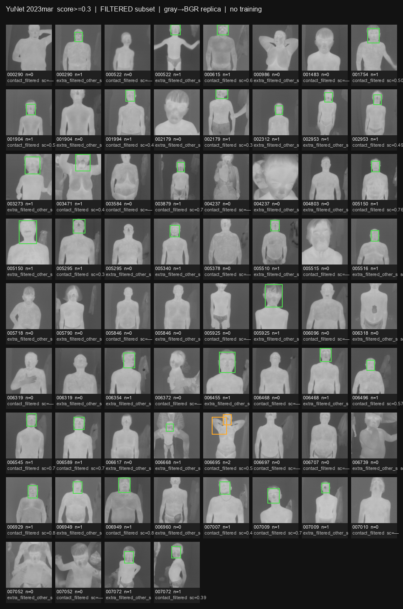

**Figure 6.** YuNet overlay preview (existing asset). Source: `reports/roi_feasibility_summary.md`.

---

### Step 15 — Manual ROI annotation

1. **Question.** Where is the face, according to a human, on a small labelled split?
2. **What we did.** Frozen 30 DEV / 30 VAL split (`derived/roi_annotation/split_frozen.json`). Interactive annotator (`scripts/08_roi_annotator.py`). Boxes stored in `reports/roi_manual_annotations.csv` with status/pose.
3. **Why necessary.** Without labels you cannot measure truncation, containment, or IoU. Detector “plausible face” gates are not ground truth.
4. **If skipped.** You would pick a crop by eyeballing contact sheets and call it validated.
5. **Discovery.** 60 labelled frames; median original occupancy 0.0668. Some frames marked `partial_face` or `multiple_people` (the crop cannot reject those).
6. **Decision.** Tune geometric/adaptive parameters **only on ROI_DEV**, then evaluate **once** on ROI_VALIDATION.

**Source:** `reports/roi_manual_annotations.csv`, `reports/roi_method_comparison.md`.

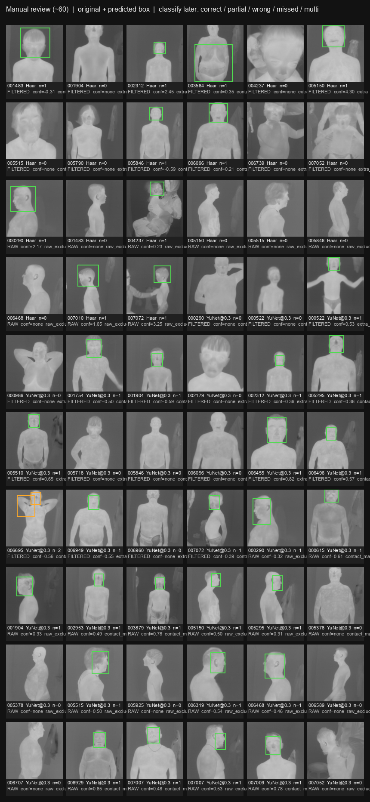

**Figure 7.** `reports/roi_manual_review_sheet.png` (copied). Source: `reports/roi_feasibility_summary.md`.

---

### Step 16 — Fixed geometric ROI selection

1. **Question.** Which crop rule generalizes: generous geometry, thermal adaptive blob, or YuNet?
2. **What we did.** `scripts/09_roi_method_comparison.py`. Started from a priori bust crop `(x=0.18, y=0, w=0.64, h=0.48)`, tuned Method A on DEV to **`(0.18, 0, 0.68, 0.56)`**. Locked in `derived/roi_annotation/locked_roi_params.json`. One-shot VAL.
3. **Why necessary.** Tight crops miss distant heads; learned detectors miss or truncate; we needed a **single frozen preprocess** for all later models.
4. **If skipped.** Every later AUC would be entangled with an unfrozen crop rule.
5. **Discovery (ROI_VALIDATION):**

   | | A geometric | B adaptive | C YuNet 0.3 |
   | --- | ---: | ---: | ---: |
   | Crop success | 100% | 100% | 55.56% |
   | Face-center contained | 100% | 100% | 55.56% |
   | Full face-box contained | 92.59% | 92.59% | 0.0% |
   | Truncation | 7.41% | 7.41% | 100.0% |
   | Median occupancy | 0.1666 | 0.1811 | 1.3696 (on detected boxes; truncated) |
   | Mean IoU vs manual | 0.1712 | 0.1946 | 0.6411 |

6. **Decision.** **Method A.** Simplest method with very high containment, low truncation, occupancy gain vs full frame, DEV→VAL generalization, no per-image tuning. YuNet’s higher IoU *when detected* does not compensate for misses and 100% truncation. The crop is **generous** (neck/shoulders remain).

**Source:** `reports/roi_method_comparison.md`. See Part 5.

---

### Step 17 — Derived `fixed_roi_v1`

1. **Question.** Can we write a frozen crop tree without touching sources?
2. **What we did.** `scripts/10_build_fixed_roi_v1.py`. Pixel box **(86, 0)–(413, 269)** → **327×269**. Crop only; JPEG quality 100, 4:4:4; no CLAHE / denoise / false colour / histogram equalization.
3. **Why necessary.** All later methods (LBPH, embeddings, adapters) must share one geometry.
4. **If skipped.** Each experiment would recrop slightly differently.
5. **Discovery.** Validation **PASS**: RAW 1198 crops, FILTERED 549 crops, all 327×269; source hashes unchanged.
6. **Decision.** **Do not retune.** All recognition uses `derived/fixed_roi_v1/`.

**Source:** `reports/fixed_roi_v1_validation.md`, `derived/fixed_roi_v1/crop_spec.json`.

---

### Step 18 — LBPH

1. **Question.** Does a classical, cheap descriptor work on this crop?
2. **What we did.** OpenCV-LBPH defaults declared before scoring: radius-1 8-neighbor LBP, 8×8 grid, 16384-d L1 histograms, chi-square, nearest-template ID. Protocol v2 + Protocol A. No CNN.
3. **Why necessary.** Lower bound. If LBPH is already strong, a neural adapter is not motivated. If it is chance, you know the crop+protocol is hard.
4. **If skipped.** You would not know whether later AUC 0.67 is “good” or merely “better than nothing”.
5. **Discovery.** FILTERED AUC **0.5638**, RAW **0.5514**, FILTERED EER **0.4470**, Rank-1 (52-way) **0.1174**. Paired FILTERED−RAW ΔAUC CI **includes 0**. CORE did not replicate a FILTERED gain.
6. **Decision.** LBPH is a **near-chance lower bound**, kept in the thesis. Not a competitive matcher. Manual FILTERED subsetting is **not** a fix for LBP.

**Source:** `reports/lbph_baseline_summary.md`, `reports/lbph_paired_delta_summary.md`.

---

### Step 19 — Frozen MobileNetV2

1. **Question.** Do generic ImageNet features carry any thermal-face signal above LBPH, with **zero** training?
2. **What we did.** Official `MobileNet_V2_Weights.IMAGENET1K_V1`, classifier removed, 1280-d GAP, L2, cosine. Preprocess not tuned: gray→3 channels, resize 256, center crop 224, ImageNet mean/std. **2,223,872** embedding parameters, **0** trainable at test.
3. **Why necessary.** If frozen ImageNet is chance, a 128-d adapter on top of it is hopeless. If it beats LBPH, there is a feature to adapt.
4. **If skipped.** You might start with ArcFace/MobileFaceNet without evidence that any CNN prior transfers.
5. **Discovery.** Protocol v2 FILTERED AUC **0.6838**, RAW **0.6313**, FILTERED EER **0.3645**, Rank-1 **0.2718**. Materially above LBPH. Paired FILTERED−RAW ΔAUC **+0.0538 [+0.0011, +0.1077] excludes 0**. Still not a usable verifier (FILTERED EER 0.3645).
6. **Decision.** MobileNet-scale frozen features are the accuracy winner among untrained methods. Next scientific step is lightweight adaptation — **but not on these 52 scores as an unseen-subject test**, because later training uses those identities.

**Source:** `reports/frozen_neural_baselines_summary.md`.

---

### Step 20 — Unaligned SFace

1. **Question.** Does a *face-specific* visible model beat generic ImageNet on thermal crops?
2. **What we did.** OpenCV Zoo SFace 128-d, 112×112 resize, **no YuNet, no landmarks, no `alignCrop`**. Same protocols.
3. **Why necessary.** A fair zero-shot face baseline. Alignment was not available because YuNet failed (Step 14).
4. **If skipped.** A reviewer could say “you should have used a face model”. You need the negative result in writing.
5. **Discovery.** FILTERED AUC **0.5686**, RAW **0.5732**, Rank-1 **0.1074** — near LBPH, **below** MobileNetV2. All paired FILTERED−RAW CIs include 0.
6. **Decision.** Unaligned SFace **did not transfer**. Do not claim “SFace would work with alignment” — alignment was not shown to be available. Negative result stays in the thesis.

**Source:** `reports/frozen_neural_baselines_summary.md`.

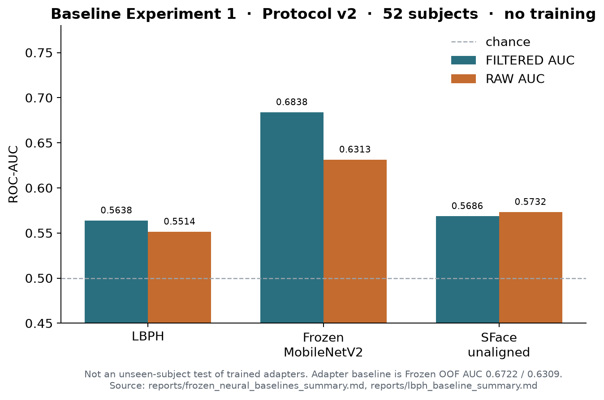

**Figure 8.** LBPH / Frozen MobileNetV2 / SFace. Source: `reports/frozen_neural_baselines_summary.md`, `reports/lbph_baseline_summary.md`.

---

### Step 21 — Paired subject bootstrap

1. **Question.** Is a 0.01 AUC difference real, or noise from 52 people?
2. **What we did.** Subject is the resampling unit. Draw subjects with replacement, 1000 iterations, seed 42. Genuine pairs of subject \(s\) repeated by draw count; impostor \((i,j)\) by \(n_i n_j\). Rank-1 uses stored probe ranks, repeated by the true subject’s draw count. A difference is **supported** only if the paired 95% CI for **ΔAUC excludes 0**.
3. **Why necessary.** With ~50 identities, point estimates bounce. Thesis claims need a pre-registered support rule.
4. **If skipped.** You would pick M2-R because 0.7917 > 0.7882 and be statistically unsupported.
5. **Discovery.** Several FILTERED vs RAW and adapter Rank-1 deltas look “positive” as points but **include 0** in the CI. ArcFace’s AUC drop **excludes 0** (harm).
6. **Decision.** Primary supported-difference rule for all adapter work: **paired ΔAUC CI**. Rank-1 is reported but not used to select the method.

**Source:** `THESIS_RESULTS_LOCK.md` §B; each `*_paired_bootstrap.csv` / `*_summary.md`.

**Ambiguity flag:** bootstrap **mean** ΔAUC is not identical to the pooled point-estimate delta. Example: M1-R − Frozen FILTERED point +0.1160 vs bootstrap mean +0.1139. Support decisions use the **CI**, not which of those two point numbers you prefer.

---

### Step 22 — Subject-disjoint adaptation folds

1. **Question.** How do we train an adapter without testing on the same identities?
2. **What we did.** Protocol `adaptation_1.0.0`, seed 42 (`scripts/14_adaptation_protocol.py`). Five folds **11 / 11 / 10 / 10 / 10**, balanced on structural metadata only (FILTERED image count, session count, RAW image count, CORE membership) — **no model scores**. Run `i`: TEST = fold `i`, VAL = fold `(i mod 5)+1`, TRAIN = the other three. Cluster-representative training images; VAL = FILTERED session-aware verification for early stopping only.
3. **Why necessary.** Fine-tuning on an identity then “verifying” that identity is not unseen-subject science.
4. **If skipped.** Adapter AUC would be an optimistic closed-set identity classifier in disguise.
5. **Discovery.** TRAIN ∩ VAL ∩ TEST = ∅. Every subject is TEST once and VAL once. Pooled OOF pairs: FILTERED genuine/impostor **557 / 980**; RAW **624 / 980**. Identification is closed-set among TEST identities only (**10 or 11**).
6. **Decision.** Freeze this protocol. Score Frozen MobileNetV2 again on these test manifests. Never use Experiment 1’s 0.6838 as the adapter baseline.

**Source:** `reports/adaptation_protocol/adaptation_protocol.md`.

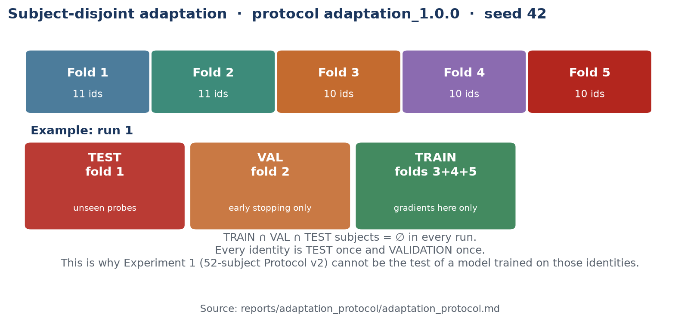

**Figure 9.** `adaptation_1.0.0`. Source: `reports/adaptation_protocol/adaptation_protocol.md`.

---

### Step 23 — Frozen-MNV2-OOD (outer-fold rescore)

1. **Question.** What is the frozen backbone worth on the *same* unseen-subject test pairs the adapter will see?
2. **What we did.** Rescored the locked ImageNet MobileNetV2 on adaptation TEST manifests. No training. Report name uses “OOD” in the filename (`frozen_mnv2_outerfold_summary.md`) meaning **outer-fold / unseen-identity**, not a second public dataset.
3. **Why necessary.** Comparing M1-F’s 0.7634 to Protocol v2’s 0.6838 would mix pair sets (5304 vs 980 impostors) and identity-overlap regimes.
4. **If skipped.** Inflated adapter “gains”.
5. **Discovery.** OOF Frozen: FILTERED AUC **0.6722**, RAW **0.6309**, EER 0.3734 / 0.4071, Rank-1 (10–11-way) 0.4228 / 0.4246.
6. **Decision.** This is the **only** frozen baseline for trained adapters.

**Source:** `reports/m1_adapter/frozen_mnv2_outerfold_summary.md`.

---

### Step 24 — M1-F

1. **Question.** Does a 128-d projection, trained with CE on FILTERED cluster reps, improve unseen-subject verification?
2. **What we did.** `scripts/15_m1_thermal_adapter.py`. Backbone frozen/eval. Linear(1280,128,bias=False)+BN1d+L2. AdamW 1e-3, wd 1e-4, batch 32, max 80, patience 10, seed 42. Classifier discarded at inference.
3. **Why necessary.** This is the actual thesis bet: parameter-efficient adaptation, not a new thermal backbone.
4. **If skipped.** You would either over-claim frozen 0.68 as “the method” or jump to full fine-tuning with no lightweight reference.
5. **Discovery.** FILTERED AUC 0.6722 → **0.7634** (point +0.0913). Paired ΔAUC **+0.0895 [+0.0339, +0.1447] excludes 0**. RAW ΔAUC **+0.0188 [−0.0491, +0.0793] includes 0**. Rank-1 CI includes 0. No pre-registered collapse flags.
6. **Decision.** Supported **FILTERED** verification gain. RAW gain **not** supported. Do not select on Rank-1. Next: is the RAW failure a **training-domain** problem?

**Source:** `reports/m1_adapter/m1_vs_frozen_summary.md`.

---

### Step 25 — M1-R (training-domain ablation)

1. **Question.** If we train on full RAW cluster reps instead of FILTERED, does RAW verification recover?
2. **What we did.** `scripts/16_m1r_raw_training_ablation.py`. Identical recipe; only TRAIN images change (617–636 RAW reps/run vs 267–286 FILTERED). Same subjects, same FILTERED validation, same TEST. M1-F not rerun.
3. **Why necessary.** FILTERED is a subset, not a better image. Maybe the adapter never saw RAW pose/quality coverage.
4. **If skipped.** You might conclude “adapters do not generalize to RAW” when you only trained on the subset.
5. **Discovery.** FILTERED AUC **0.7882**, RAW **0.7233**. M1-R − Frozen FILTERED ΔAUC **+0.1139 [+0.0652, +0.1580]** and RAW **+0.0899 [+0.0272, +0.1483]** (both exclude 0); both ΔEER CIs also exclude 0. M1-R − M1-F RAW ΔAUC **+0.0710 [+0.0311, +0.1102] excludes 0**; FILTERED ΔAUC vs M1-F **includes 0**. Rank-1 CIs include 0. Two runs flagged **unstable** (not collapse).
6. **Decision.** Training-data/domain coverage recovered RAW. M1-R becomes the strongest **supported** CE operating point — pending the matched-count check that the gain is not *only* extra sample size.

**Source:** `reports/m1r_adapter/m1r_vs_m1f_vs_frozen_summary.md`.  
**Note on order:** M1-R was run (report timestamp 2026-08-27 19:05) **before** M1-RM (19:33). The next step is the dissection that isolates domain vs size.

---

### Step 26 — M1-RM (matched-count RAW)

1. **Question.** At the **same per-subject count** as M1-F, does sampling RAW reps already help RAW? Does the remaining larger pool add more?
2. **What we did.** `scripts/17_m1rm_matched_count_ablation.py`. RAW reps with **exactly** M1-F’s per-subject count, session round-robin, no score/pose/FILTERED-membership preference. Counts 275/286/283/269/267 matching M1-F. M1-F and M1-R not rerun.
3. **Why necessary.** Otherwise “RAW training helped” confounds *domain* with *more images*.
4. **If skipped.** You could not say whether to keep the full RAW pool in the final method.
5. **Discovery.** RAW AUC Frozen 0.6309 / M1-F 0.6531 / **M1-RM 0.6934** / M1-R 0.7233. M1-RM − M1-F RAW ΔAUC **+0.0406 [+0.0072, +0.0709] excludes 0**. M1-R − M1-RM RAW **+0.0304 [+0.0024, +0.0605] excludes 0** and FILTERED **+0.0519 [+0.0167, +0.0880] excludes 0**. Rank-1 CIs include 0. One M1-RM run flagged overfit.
6. **Decision.** **Both domain and size** contribute on RAW. Final CE method keeps the **full RAW representative pool** (M1-R), not the matched-count subset.

**Source:** `reports/m1rm_adapter/m1rm_vs_m1f_m1r_summary.md`.

---

### Step 27 — M2-R (partial backbone)

1. **Question.** Does unfreezing only the last inverted residual (`features[17]`, 473,920 params, LR 1e-4) beat M1-R?
2. **What we did.** `scripts/18_m2r_partial_backbone.py`. Stem and other blocks stay frozen/eval. Same RAW manifests. M1-R not rerun.
3. **Why necessary.** Maybe the ImageNet last block is the bottleneck. Test it before claiming “frozen is enough”.
4. **If skipped.** A reviewer asks why you did not fine-tune; you would have no answer.
5. **Discovery.** Point FILTERED AUC 0.7882 → **0.7917** (+0.0035); RAW 0.7233 → **0.7324** (+0.0091). Paired RAW ΔAUC **+0.0087 [−0.0269, +0.0476] includes 0**; FILTERED likewise. Rank-1 **declined** in point estimate. Trainable params 164,096 → **638,016**. Mean train time 1.2 s/fold → **786.0** s/fold. One overfit flag (vs 0 on M1-R).
6. **Decision.** **Outcome B.** Keep the backbone frozen. M3 was not started.

**Source:** `reports/m2r_adapter/m2r_vs_m1r_summary.md`.

---

### Step 28 — M1-R-ArcFace

1. **Question.** Does ArcFace (s=30, m=0.50 rad) beat CE with the same frozen backbone and RAW train images?
2. **What we did.** `scripts/19_m1r_arcface.py`. Loss only changes. No hyperparameter search. M1-R-CE not rerun.
3. **Why necessary.** Angular-margin losses are the default story in modern face recognition. Test the obvious alternative.
4. **If skipped.** You would publish CE without showing you checked the standard FR loss.
5. **Discovery.** FILTERED AUC 0.7882 → **0.7393**; RAW 0.7233 → **0.6787**. Paired ΔAUC FILTERED **−0.0474 [−0.0904, −0.0077]** and RAW **−0.0435 [−0.0892, −0.0013]**, both exclude 0, **mean negative**. Rank-1 CIs include 0 (slight point increase). One unstable flag.
6. **Decision.** **Outcome C.** Reject ArcFace at the locked hyperparameters. **No further model experiment.**

**Source:** `reports/m1r_arcface/m1r_arcface_vs_ce_summary.md`.

---

### Step 29 — Final M1-R-CE selection

1. **Question.** Which operating point is allowed by the support rule *and* the lightweight thesis framing?
2. **What we did.** Applied the lock document: supported ΔAUC, no extra backbone training without support, no loss that harms AUC, Rank-1 not a selector.
3. **Why necessary.** Point estimates alone would pick M2-R.
4. **If skipped.** You would either over-claim M2 or keep iterating forever.
5. **Discovery.** M1-R-CE is the only lightweight recipe with **supported** unseen-subject verification gains vs frozen features on **both** FILTERED and RAW OOF AUC (and supported EER reductions vs frozen on both).
6. **Decision.** Lock **M1-R-CE**. Writing/publication from here; no new runs unless newly approved.

**Source:** `THESIS_RESULTS_LOCK.md` §F, `PROJECT_STATE.md`.

---

<a id="part-3"></a>
# Part 3 — Dataset visual explanation

## RAW is the full local collection; FILTERED is a kept subset

```
RAW 1198 files
 └── FILTERED 549 files   ← mostly the same JPEGs, fewer of them
```

It is **not**: denoised RAW, contrast-enhanced RAW, or a face-cropped RAW.

Evidence:

- Audit match: 545 FILTERED files matched to RAW (531 identical relative path, 13 unique filename, 1 pHash).
- Contact sheets: 36/36 sampled pairs pixel-identical.
- 4 FILTERED images unmatched by design (incomplete RAW export of those instance numbers).

**Sources:** `reports/audit_summary.md`, `reports/contact_sheet_notes.md`.

## Counts you should be able to recite

| Quantity | Value | Source |
| --- | ---: | --- |
| RAW images | 1198 | `audit_summary.md` |
| FILTERED images | 549 | `audit_summary.md` |
| Retention | 45.83% | `audit_summary.md` |
| RAW subject folders | 63 | `audit_summary.md` |
| FILTERED subject folders | 62 | `audit_summary.md` |
| Common folders before alias | 61 | `audit_summary.md` |
| After alias, RAW-only leftover | `007144` (4 images) | `audit_summary.md` |
| Locked multi-session cohort | 52 | `session_audit_summary.md` |
| CORE_SUBSET (sensitivity) | 42 | `evaluation_protocol_v2.md` |
| RAW effective independent | 1198 → 1117 | `session_audit_summary.md` |
| FILTERED effective independent | 549 → 492 | `session_audit_summary.md` |

All images: 480×480, Pillow mode `L`, JPEG, UID-like names with timestamps (`image_technical_summary.csv`).

See Figures 1–4.

---

<a id="part-4"></a>
# Part 4 — Near-duplicate / session leakage

This is the methodological heart of the thesis. If you explain only one figure to Hoca besides results, explain this one.

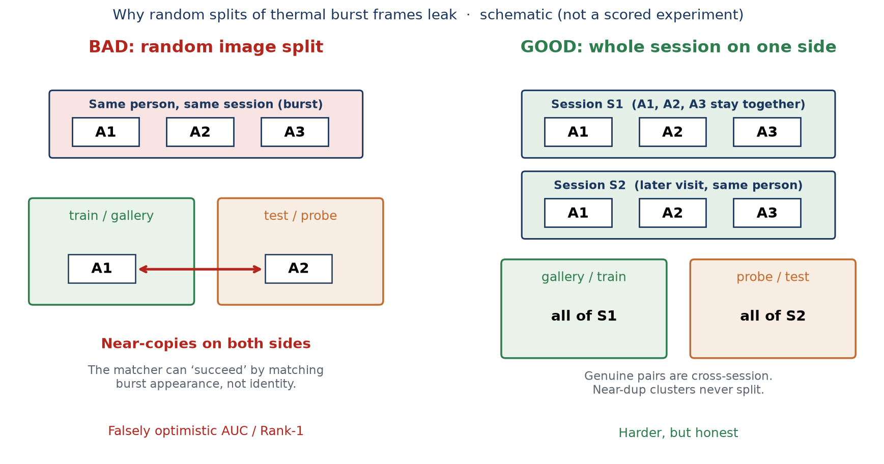

**Figure 10.** Schematic of leakage. Not a scored experiment. The protocol implements the right-hand side.

## What a burst is, in this dataset

Filenames look like `1.2.410.2000001.5.2.1.20190211033705.2.1.1.jpg`. The `20190211033705` piece is a timestamp. Several JPEGs share that timestamp (or sit within 30 minutes) → one **session**. Frames within a session are often **near-duplicates** (example in `near_duplicate_groups.csv`: `raw_near_0067` is five consecutive `006545` frames from `20190211033705`).

## Why a random split is optimistic

If A1 goes to gallery and A2 to probe, a matcher can succeed by matching **sensor state / pose / temperature of that second**, not identity across time. Genuine scores become easy. AUC and Rank-1 go up. The number is not a lie about the code — it is a lie about the *scientific question*.

## What we did instead

| Control | Rule |
| --- | --- |
| Session separation | Genuine pairs must be **different sessions** |
| Cluster integrity | A near-dup cluster is wholly gallery or wholly probe / not split across a genuine pair |
| Impostors | Different subjects; v2 schedule balanced |
| Adaptation | Whole **identity** on one side of TRAIN/VAL/TEST |

## Why subject-disjoint adaptation was later required

Session control stops **frame leakage**. It does not stop **identity leakage**.

If you train an adapter with CE on person 000290, then test verification pairs of 000290, the model has already been told “this is class 000290”. That is closed-set classification of a seen identity, not unseen-subject verification.

So: Protocol v2 / Protocol A = honest scoring of **frozen** methods on 52 people.  
`adaptation_1.0.0` = honest scoring of **trained** methods on people who were **held out of gradients**.

See Figure 9.

**Ambiguity flag:** pHash groups can over-cluster. Session splits are preferred over hash groups alone (`session_audit_summary.md`). Cross-subject similar pairs were **reported, never merged** — we did not decide those 15 pairs are the same person.

---

<a id="part-5"></a>
# Part 5 — ROI story

Images are **480×480 upper-body / bust** thermal frames. The face is a small hot island. Torso, clothes, and background can leak identity or scale. Visible-light detectors were unreliable.

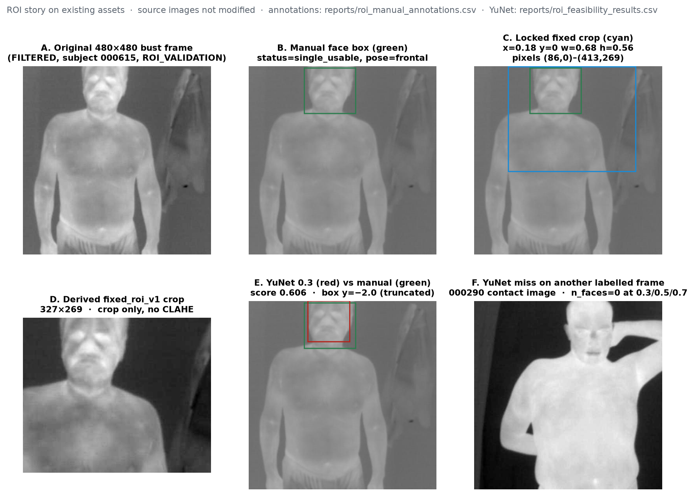

**Figure 11.** Built from existing files + `reports/roi_manual_annotations.csv` + `reports/roi_feasibility_results.csv`. Sources were not modified.

How to read the boxes on 000615:

| Box | Coordinates | Meaning |
| --- | --- | --- |
| Manual (green) | (141, 3)–(274, 121) | Human face box, `single_usable`, frontal, ROI_VALIDATION |
| Fixed crop (cyan) | (86, 0)–(413, 269) | Locked Method A; contains the face plus neck/shoulders |
| YuNet 0.3 (red) | xywh (150.18, **−2.0**, 109.32, 106.81), score 0.60622 | Detected, but **truncated at the top of the frame** |

Panel F is the other failure mode: YuNet `n_faces=0` at 0.3/0.5/0.7 on the 000290 contact image (also in the feasibility CSV).

## Why `(x=0.18, y=0.00, w=0.68, h=0.56)` was selected

1. Contact sheets said heads sit in the **upper centre**, with large scale variation — a tight box would miss distant heads.
2. A priori diagnostic crop was `(0.18, 0, 0.64, 0.48)`; DEV tuning widened it to **w=0.68, h=0.56**.
3. On 480×480: `round` then clip → **(86, 0)–(413, 269)** = **327×269**.
4. Decision rule (locked): prefer the simplest method with very high face-center containment, low truncation, occupancy gain vs the full frame, DEV→VAL generalization, no per-image hand tuning.

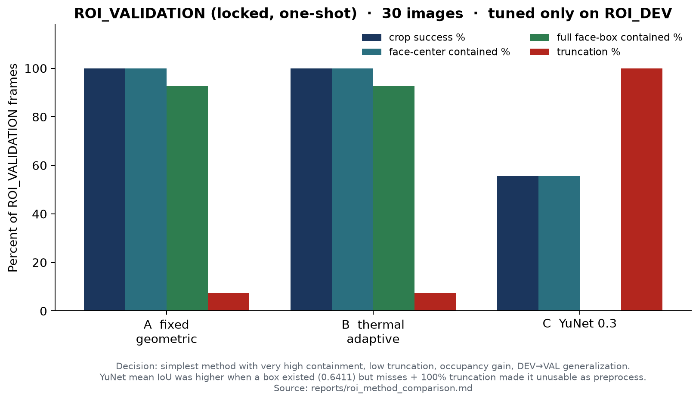

**Figure 12.** Source: `reports/roi_method_comparison.md`.

### Validation metrics in plain language

| Metric | Intuition | Winner here |
| --- | --- | --- |
| Crop success | Did we output a box at all? | A and B 100%; YuNet 55.56% |
| Face-center contained | Is the middle of the labelled face inside the crop? | A/B 100% |
| Full face-box contained | Is the entire labelled face inside? | A/B 92.59%; YuNet **0%** |
| Truncation | Did we cut the labelled face? | A/B 7.41%; YuNet **100%** of detections |
| Occupancy | Face area / crop area (higher = less torso) | Original frame median 0.0668 → geometric crop 0.1666 |
| IoU | Overlap with the tight manual box | YuNet higher **when it fires** (mean 0.6411) but it often does not fire, and when it does it truncates |

IoU looks “worse” for the generous crop **by construction**: a crop that includes shoulders will not match a tight face box. That is acceptable if the scientific goal is “never miss the face”, not “tight mugshot”.

**Ambiguity flag:** Method B (adaptive) is close to A on VAL containment/truncation. A was chosen as **simpler** (no per-image blob logic), not because B failed containment. Unusable frames (`multiple_people` etc.) still pass a geometric crop — the crop cannot reject them.

No CLAHE, denoise, or false colour was applied (`fixed_roi_v1_validation.md`).

---

<a id="part-6"></a>
# Part 6 — What each model actually does

Think of every method as: **image in → vector out → compare two vectors**.

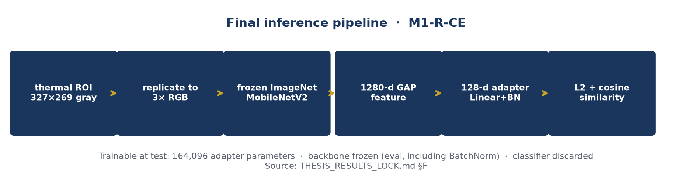

**Figure 13.** Source: `THESIS_RESULTS_LOCK.md` §F.

---

### LBPH (Local Binary Pattern Histogram)

| | |
| --- | --- |
| **Input** | 327×269 grayscale ROI |
| **Feature** | Each pixel coded as 8-bit texture vs neighbours (radius 1); 8×8 spatial grid; 256-bin histograms concatenated → **16384-d**, L1-normalized |
| **Compare** | Chi-square distance (lower = more similar) |
| **Trained?** | Nothing. Fixed recipe, not searched on test data |
| **Why included** | Cheap classical lower bound; historical face-recognition baseline |

If two crops have similar local texture layout, distance is small. On this bust crop, texture is weak → near chance.

---

### Frozen MobileNetV2

| | |
| --- | --- |
| **Input** | Gray ROI replicated to 3 channels; resize 256; center crop 224; ImageNet mean/std |
| **Feature** | Official ImageNet CNN, classifier removed; global average pool → **1280-d**, L2-normalized |
| **Compare** | Cosine similarity (higher = more similar) |
| **Trained?** | **No** (on this dataset). ImageNet weights frozen. 2,223,872 params, 0 trainable |
| **Why included** | Generic visual features. Test whether ImageNet prior transfers at all |

---

### SFace (unaligned)

| | |
| --- | --- |
| **Input** | Gray→BGR replica; resize **112×112**; **no alignment** |
| **Feature** | OpenCV Zoo face-recognition ONNX → **128-d**, L2 |
| **Compare** | Cosine |
| **Trained?** | No (on this dataset). Visible-spectrum face model, frozen |
| **Why included** | Face-specific zero-shot control vs generic ImageNet |

It failed here. That is a result, not an implementation accident you should hide.

---

### M1 adapter (used in M1-F, M1-RM, M1-R-CE)

| | |
| --- | --- |
| **Input** | Same frozen MobileNetV2 1280-d vector |
| **Feature** | Linear 1280→128 (no bias) + BatchNorm1d + L2 → **128-d** |
| **Compare** | Cosine on 128-d |
| **Trained?** | Adapter + a **temporary identity classifier** with cross-entropy on TRAIN identities. Classifier discarded. Backbone frozen including BatchNorm running stats |
| **Why included** | Parameter-efficient domain adaptation (164,096 trainable params) |

M1-F / M1-RM / M1-R differ **only in which training images** the adapter sees, not in architecture.

---

### M2 partial fine-tuning (M2-R)

Same as M1-R, plus **unfreeze MobileNetV2 `features[17]`** (last inverted residual, 473,920 params) at LR 1e-4. Adapter stays at 1e-3. That block is in train mode during train batches; the rest of the backbone stays eval.

**Why included:** test whether a little backbone plasticity helps. It did not, by the ΔAUC rule.

---

### ArcFace (M1-R-ArcFace)

Same frozen backbone and 128-d adapter and RAW images as M1-R-CE. Training objective becomes **additive angular margin** (s=30, m=0.50 rad; Deng et al. CVPR 2019, InsightFace π-wrap fallback) instead of linear CE. Class weights exist only for that run’s TRAIN identities and are discarded at val/test. Inference is still cosine on 128-d.

**Why included:** the standard modern FR loss. **Harmed** verification AUC at these locked settings (no search).

---

<a id="part-7"></a>
# Part 7 — Metrics for a software engineer

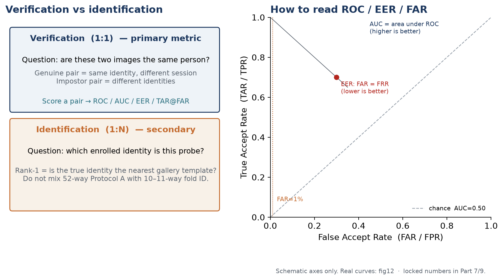

**Figure 14.** Teaching schematic. Real curve: Figure 15.

## Verification vs identification

| | Verification | Identification |
| --- | --- | --- |
| Question | Same person? | Which enrolled person? |
| Input | A **pair** | A **probe** vs a **gallery** |
| Output | Score → threshold → accept/reject | Ranked list of identities |
| Our primary protocol | Protocol v2 / OOF verification | Protocol A / fold ID (secondary) |

## Genuine vs impostor

**Genuine pair:** same canonical subject, **different sessions**, different near-dup clusters.  
Example from `m1r_oof_verification_filtered.csv`: `000290` session `20180103055643` vs `20190102065800`.

**Impostor pair:** two different subjects, scheduled so every unordered subject pair is represented (v2: up to 4 pairs; adaptation OOF: TEST-subjects only).

## ROC curve

Sort all pairs by score. Sweep a threshold. For each threshold:

- **TAR** (TPR, true accept): fraction of genuine pairs accepted
- **FAR** (FPR, false accept): fraction of impostor pairs accepted

Plot TAR vs FAR. Chance is the diagonal.

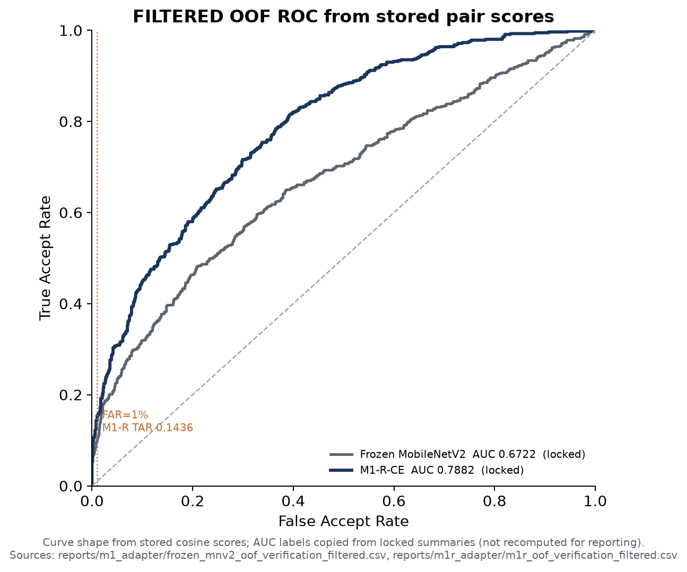

**Figure 15.** Sources: `reports/m1_adapter/frozen_mnv2_oof_verification_filtered.csv`, `reports/m1r_adapter/m1r_oof_verification_filtered.csv`; AUC from `m1r_vs_m1f_vs_frozen_summary.md`.

## ROC-AUC

Area under that curve. **Higher is better.** 0.50 = chance. 1.00 = every genuine outranks every impostor.

Our examples (locked):

- LBPH FILTERED Protocol v2: **0.5638** ≈ weak
- Frozen MNV2 OOF FILTERED: **0.6722**
- M1-R-CE OOF FILTERED: **0.7882**

## EER (equal error rate)

The operating point where **FAR = FRR** (false reject = 1 − TAR). **Lower is better.**

M1-R-CE FILTERED EER **0.2962** means: at that threshold FAR and FRR both equal 0.2962. That is why we do not call this operational.

## FAR and TAR @ FAR 1%

**FAR** = false accept rate. “1% FAR” means 1 in 100 impostor pairs would be accepted.

**TAR @ FAR=1%** = how many genuine pairs you still catch at that strictness.

M1-R-CE FILTERED TAR@1% = **0.1436** (fraction of genuine pairs still accepted when FAR is 0.01). Frozen OOF was 0.0952.

**Ambiguity flag:** Protocol v2 also reports TAR @ FAR=**0.1%**. That uses ~5 false accepts on 5304 impostors and is **descriptive only** (`frozen_neural_baselines_summary.md`). Do not treat it as a precise operating characteristic.

## Rank-1 and Rank-5

Closed-set identification: each probe is compared to gallery templates (nearest template per identity).

- **Rank-1:** true identity is the top match
- **Rank-5:** true identity is among the five nearest identities

## Why Rank-1 cannot be mixed across protocols

| Context | Who is in the gallery? | Chance Rank-1 (uniform) |
| --- | --- | --- |
| Protocol A | **52** identities | \(1/52\) if uniform (illustration only, not a measured score) |
| Adaptation OOF | **10 or 11** TEST-fold identities | \(1/10\) or \(1/11\) if uniform (illustration only) |

Adapter Rank-1 ~0.46 looks “better” than Protocol A Rank-1 ~0.27 partly because the closed set is **smaller**. Different questions. Never put them in one unlabelled column.

Locked examples:

- Frozen MNV2 Protocol A FILTERED Rank-1 **0.2718** (52-way)
- Frozen MNV2 OOF FILTERED Rank-1 **0.4228** (10–11-way)
- M1-R-CE OOF FILTERED Rank-1 **0.4664** — Δ vs Frozen CI **includes 0**, so even *within* 10–11-way we do **not** claim a Rank-1 win

## Paired bootstrap confidence interval

Imagine the 52 people are a sample from a larger population. Resample **people**, recompute ΔAUC, 1000 times. The 2.5th and 97.5th percentiles are the 95% CI.

- If the CI is entirely above 0: supported **gain**
- Entirely below 0: supported **harm**
- Crosses 0: **do not claim** a difference, even if the bar chart looks nicer

See Figure 17 (forest plot).

---

<a id="part-8"></a>
# Part 8 — Experiment evolution

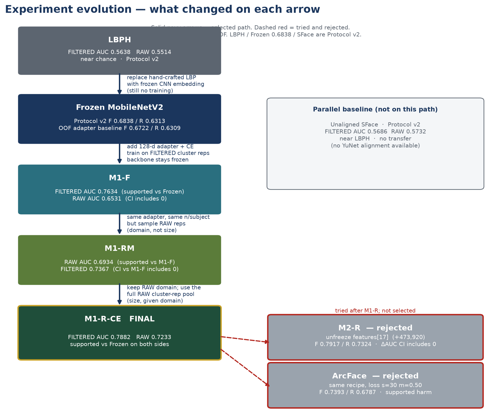

**Figure 16.** Sources: `reports/final_master_results.md`, `reports/thesis_experiment_flow.md`, adapter summaries. Adapter AUCs are pooled OOF; LBPH / Frozen 0.6838 / SFace are Protocol v2.

## What changed on each arrow

| Arrow | What changed | What did *not* change |
| --- | --- | --- |
| LBPH → Frozen MNV2 | Hand-crafted 16384-d LBP+chi-square → ImageNet CNN 1280-d cosine. Still **no training on thermal** | ROI, 52-subject Protocol v2 / A, seed 42 |
| Frozen MNV2 → M1-F | Add 128-d adapter + CE on **FILTERED** cluster reps. Backbone frozen | ROI, folds (`adaptation_1.0.0`), TEST manifests |
| M1-F → M1-RM | TRAIN images = RAW reps with **exactly** M1-F’s per-subject count (domain at matched *n*) | Architecture, optimiser, FILTERED val, TEST |
| M1-RM → M1-R | TRAIN images = **full** RAW cluster-rep pool (size, given RAW domain) | Same as above |
| M1-R → M2-R | Unfreeze last inverted residual (+473,920 params) | RAW train manifests, adapter, seed |
| M1-R → ArcFace | Loss = ArcFace s=30 m=0.50 instead of CE | Backbone frozen, RAW images, adapter |

SFace sits **beside** Frozen MNV2 as a failed face-specific zero-shot, not on the selected path.

**Do not read the figure as “M2 is slightly better therefore preferred.”** The gold box is M1-R because of the CI rule, not because it has the tallest bar.

---

<a id="part-9"></a>
# Part 9 — Results

Two evaluation contexts — do not mix columns:

| Context | Impostors | ID gallery | Who uses it |
| --- | ---: | --- | --- |
| Protocol v2 / Protocol A | 5304 | **52-way** | LBPH, Frozen MNV2, SFace |
| `adaptation_1.0.0` OOF | 980 | **10 or 11-way** | Frozen rescore + all adapters |

## Baseline Experiment 1 (no training)

| Method | FILTERED AUC | RAW AUC | FILTERED EER | RAW EER | FILTERED Rank-1 (52-way) | RAW Rank-1 |
| --- | ---: | ---: | ---: | ---: | ---: | ---: |
| LBPH | 0.5638 | 0.5514 | 0.4470 | 0.4615 | 0.1174 | 0.1109 |
| Frozen MobileNetV2 | 0.6838 | 0.6313 | 0.3645 | 0.4087 | 0.2718 | 0.2411 |
| SFace unaligned | 0.5686 | 0.5732 | 0.4506 | 0.4519 | 0.1074 | 0.1228 |

**Source:** `reports/final_master_results.md` / `.csv`; `reports/lbph_baseline_summary.md`; `reports/frozen_neural_baselines_summary.md`.

Existing Protocol v2 ROC plots (copied, not redrawn): `asset_lbph_roc_filtered.png`, `asset_mnv2_roc_filtered.png`, `asset_sface_roc_filtered.png`.

## Adaptation OOF (trained adapters + frozen rescore)

| Method | FILTERED AUC | RAW AUC | FILTERED EER | RAW EER | FILTERED Rank-1 (10–11-way) | RAW Rank-1 |
| --- | ---: | ---: | ---: | ---: | ---: | ---: |
| Frozen MobileNetV2 | 0.6722 | 0.6309 | 0.3734 | 0.4071 | 0.4228 | 0.4246 |
| M1-F | 0.7634 | 0.6531 | 0.3232 | 0.3990 | 0.4530 | 0.4231 |
| M1-RM | 0.7367 | 0.6934 | 0.3285 | 0.3606 | 0.4799 | 0.4379 |
| **M1-R-CE** | **0.7882** | **0.7233** | **0.2962** | **0.3285** | 0.4664 | 0.4438 |
| M2-R | 0.7917 | 0.7324 | 0.2873 | 0.3285 | 0.4295 | 0.4083 |
| M1-R-ArcFace | 0.7393 | 0.6787 | 0.3196 | 0.3766 | 0.4732 | 0.4482 |

**Source:** `reports/final_master_results.csv` (copied from the adapter `*_summary.md` files listed in that CSV’s last column).

M1-R-CE also locked: TAR @ FAR=1% FILTERED **0.1436**, RAW **0.0897**; Rank-5 FILTERED **0.9027**, RAW **0.8595** (`THESIS_RESULTS_LOCK.md` §F). Rank-5 is reported there; adapter Rank-1/5 deltas are still not the selection criterion.

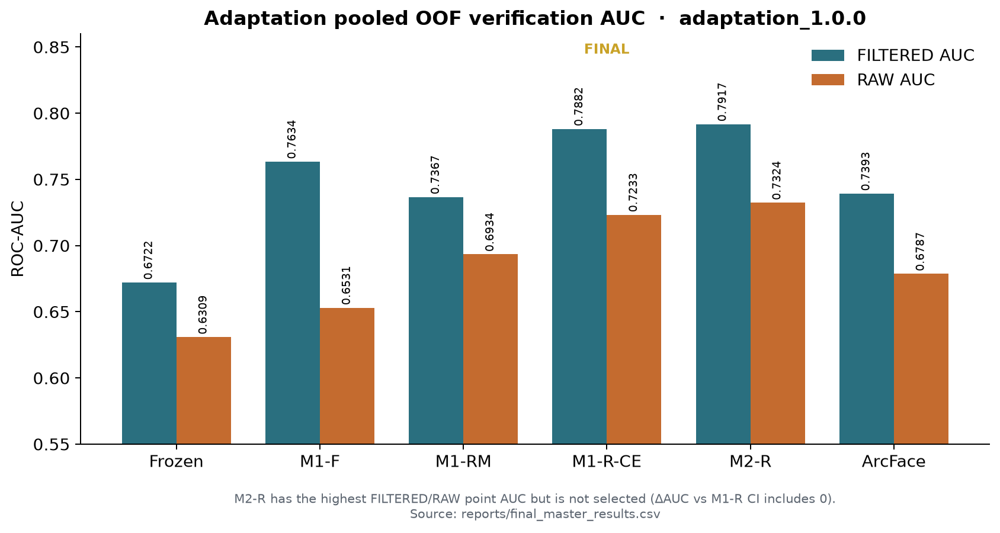

**Figure 17.** Source: `reports/final_master_results.csv`.

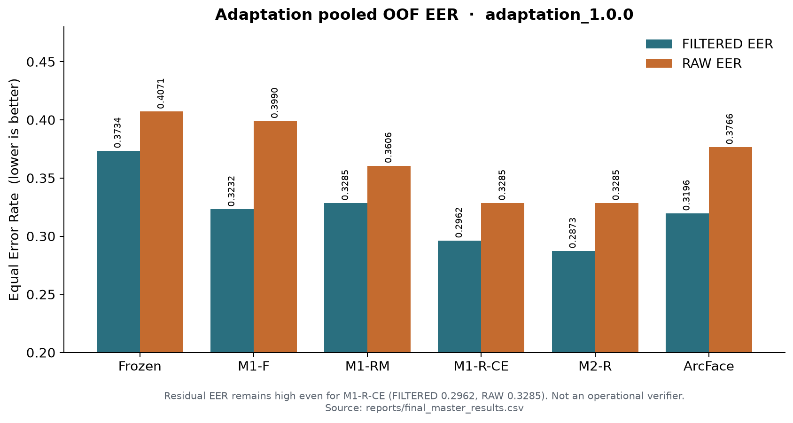

**Figure 18.** Source: `reports/final_master_results.csv`.

**Ambiguity flag:** M2-R RAW EER is **0.3285**, the same 4-decimal value as M1-R-CE RAW EER. That is what the lock table records; do not invent a story that they are “exactly equal in probability”.

## Paired ΔAUC (the statistical figure)

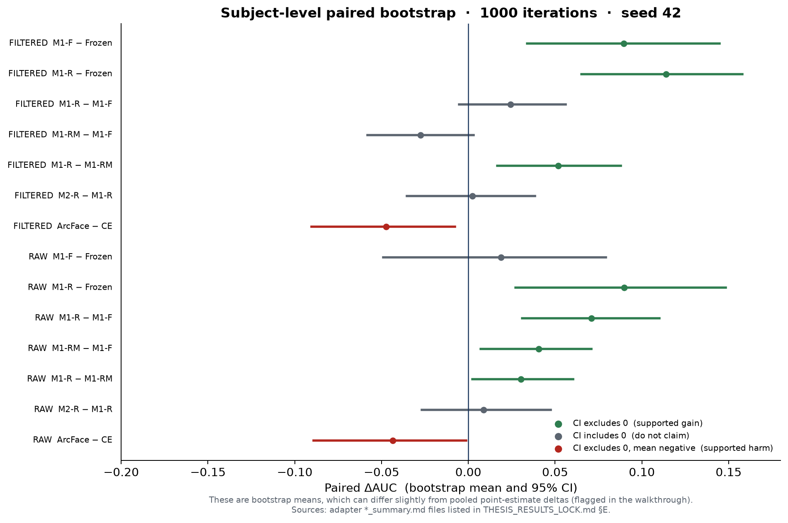

**Figure 19.** Copied from adapter summary markdowns (bootstrap mean [2.5, 97.5]). Seed 42, 1000 iterations.

| Comparison | FILTERED ΔAUC mean [95% CI] | RAW ΔAUC mean [95% CI] | Source |
| --- | --- | --- | --- |
| M1-F − Frozen | +0.0895 [+0.0339, +0.1447] **excl. 0** | +0.0188 [−0.0491, +0.0793] incl. 0 | `m1_adapter/m1_vs_frozen_summary.md` |
| M1-R − Frozen | +0.1139 [+0.0652, +0.1580] **excl. 0** | +0.0899 [+0.0272, +0.1483] **excl. 0** | `m1r_adapter/m1r_vs_m1f_vs_frozen_summary.md` |
| M1-R − M1-F | +0.0244 [−0.0054, +0.0562] incl. 0 | +0.0710 [+0.0311, +0.1102] **excl. 0** | same |
| M1-RM − M1-F | −0.0275 [−0.0581, +0.0030] incl. 0 | +0.0406 [+0.0072, +0.0709] **excl. 0** | `m1rm_adapter/m1rm_vs_m1f_m1r_summary.md` |
| M1-R − M1-RM | +0.0519 [+0.0167, +0.0880] **excl. 0** | +0.0304 [+0.0024, +0.0605] **excl. 0** | same |
| M2-R − M1-R | +0.0024 [−0.0354, +0.0385] incl. 0 | +0.0087 [−0.0269, +0.0476] incl. 0 | `m2r_adapter/m2r_vs_m1r_summary.md` |
| ArcFace − CE | −0.0474 [−0.0904, −0.0077] **harm** | −0.0435 [−0.0892, −0.0013] **harm** | `m1r_arcface/m1r_arcface_vs_ce_summary.md` |

No CI in this table is “almost excluding 0” turned into a claim. Grey rows stay grey.

---

<a id="part-10"></a>
# Part 10 — Why M1-R-CE won

**Definition (memorize this paragraph):**  
Official ImageNet MobileNetV2 + **frozen** backbone + **164,096**-parameter 128-d adapter + **RAW cluster-representative** training + **CE** (train only) + classifier discarded + **L2 128-d** + **cosine**.

## Why this combination

| Ingredient | Why it is in the final method |
| --- | --- |
| Frozen backbone | M2-R’s extra 473,920 params did not produce a supported ΔAUC; train time exploded (1.2 → 786.0 s/fold) |
| 164,096 adapter | Supported FILTERED gain already at M1-F; inference stays MobileNetV2 + 7.38% extra params |
| RAW cluster reps | M1-F’s RAW gain was unsupported; M1-R vs Frozen is supported on **both** sides |
| Full RAW pool, not matched-count | M1-RM showed domain helps; M1-R vs M1-RM still supported on RAW (and FILTERED) |
| CE, not ArcFace | ArcFace **harmed** both AUCs with CIs excluding 0 |
| 128-d cosine | Matches the lightweight embedding story; classifier is a training device only |

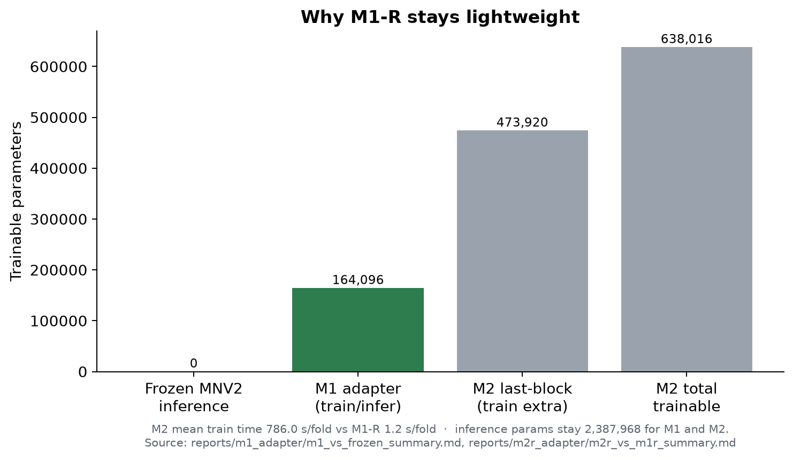

**Figure 20.** Sources: `reports/m1_adapter/m1_vs_frozen_summary.md`, `reports/m2r_adapter/m2r_vs_m1r_summary.md`.

## Why not the others

| Method | Why not final |
| --- | --- |
| **M2-R** | Higher point AUC, but paired ΔAUC CI **includes 0** on FILTERED and RAW. Rank-1 point estimates fell. More parameters. Mean train time 1.2 s/fold → 786.0 s/fold. Outcome B |
| **ArcFace** | Supported **harm** on both AUCs. Outcome C |
| **SFace** | Near LBPH; did not beat ImageNet MobileNetV2; unaligned because YuNet could not provide alignment |
| **LBPH** | Near chance; lower bound only |
| **M1-F** | Supported only on FILTERED; RAW generalization failed the CI rule |
| **M1-RM** | Useful ablation; full RAW pool still added a supported gain, so the operating point keeps M1-R |

## Efficiency argument (what you can actually say)

- Inference: frozen MobileNetV2 + 164,096 adapter params, **2,387,968** total inference params, 128-d cosine.
- M1 vs frozen: +7.38% parameters (`m1_vs_frozen_summary.md`). That table lists embed time 0.1046 vs 0.1065 s/image and an “Added” column of 0.0000 — **do not resolve that rounding internally; quote the table as written.**
- M2 does **not** reduce inference size (backbone still present); it only trains more of it, slowly, without a supported AUC gain.

This is “small supervised adapter on frozen visual features”, **not** a new thermal backbone.

---

<a id="part-11"></a>
# Part 11 — What we can and cannot claim

Copied in spirit from `THESIS_RESULTS_LOCK.md` §F–G and `PAPER_OUTLINE.md`. If a sentence is not in the left table, do not say it in a defense.

## SUPPORTED CLAIMS

| # | Claim | Evidence |
| --- | --- | --- |
| 1 | After session and near-duplicate control, a 52-subject cohort supports a leakage-checked verification study (and a small closed-set ID experiment) | Protocols v2 / A validation PASS |
| 2 | FILTERED is essentially a **subset of RAW files**, not a pixel-processed enhancement | Matches + 36/36 pixel-identical contact pairs |
| 3 | Off-the-shelf YuNet/Haar are not reliable thermal detectors on this bust geometry at the tested thresholds | Feasibility + VAL truncation/misses |
| 4 | A fixed geometric crop contains the face centre on 100% of ROI_VALIDATION with 7.41% truncation | `roi_method_comparison.md` |
| 5 | LBPH is near chance on this crop/protocol | FILTERED AUC 0.5638, EER 0.4470 |
| 6 | Frozen ImageNet MobileNetV2 is materially above LBPH on Protocol v2 FILTERED AUC/Rank-1 | 0.6838 vs 0.5638; 0.2718 vs 0.1174 |
| 7 | Unaligned SFace did not transfer (near LBPH, below MobileNetV2) | FILTERED AUC 0.5686 |
| 8 | Manual FILTERED subsetting is **not** a universal improvement | LBPH and SFace FILTERED−RAW CIs include 0 |
| 9 | A 128-d adapter trained on FILTERED reps improves **unseen-subject FILTERED** verification vs frozen OOF | ΔAUC CI excludes 0 |
| 10 | That FILTERED-only adapter does **not** have a supported RAW AUC gain | RAW CI includes 0 |
| 11 | RAW-domain sampling at matched count improves RAW AUC vs M1-F | M1-RM − M1-F RAW CI excludes 0 |
| 12 | The remaining larger RAW pool adds a further supported ΔAUC | M1-R − M1-RM both sides exclude 0 (FILTERED and RAW) |
| 13 | M1-R-CE improves unseen-subject verification vs frozen OOF on **both** FILTERED and RAW AUC (and EER) | M1-R − Frozen CIs exclude 0 |
| 14 | Unfreezing the last MobileNetV2 block does **not** provide a supported AUC gain vs M1-R | M2-R CIs include 0 |
| 15 | ArcFace at s=30, m=0.50 **harms** FILTERED and RAW verification AUC vs CE | CIs exclude 0, negative mean |
| 16 | Adapter Rank-1 gains are **not** statistically established | Rank-1 CIs include 0, including M1-R vs Frozen |

## DO NOT CLAIM

| # | Do not say | Why |
| --- | --- | --- |
| 1 | Operational / deployment-ready biometric accuracy | FILTERED EER 0.2962; TAR@1% 0.1436 |
| 2 | State-of-the-art thermal face recognition | Small local corpus; no large-scale comparison |
| 3 | This dataset **is** Tufts / Charlotte-Thermal / any named public benchmark | No local dataset card or citation |
| 4 | Ethics approval / IRB / consent details | Not in local files — **do not infer** |
| 5 | Folder IDs are externally verified person identities | Audit: grouping keys only |
| 6 | FILTERED is a quality-enhancing preprocessor | Same pixels when matched |
| 7 | YuNet/Haar “almost work” so we could have aligned SFace | VAL success 55.56%, 100% truncation; SFace was unaligned by design |
| 8 | M2-R is better because 0.7917 > 0.7882 | CI includes 0 |
| 9 | ArcFace is better because Rank-1 ticked up | Rank-1 CI includes 0; AUC harm is supported |
| 10 | CE beats ArcFace on thermal data **in general** | One locked (s, m), no search, one corpus |
| 11 | Identification Rank-1 improved | Adapter Rank-1 CIs include 0 |
| 12 | 52-way Rank-1 and 10–11-way Rank-1 are comparable | Different gallery sizes |
| 13 | Protocol v2 Frozen 0.6838 is the adapter baseline | Wrong pair set / identity-overlap regime; use OOF 0.6722 |
| 14 | Open-set identification / watchlist search | Closed-set only |
| 15 | A new thermal backbone was trained | Backbone frozen in the selected method |
| 16 | Cross-dataset generalization | Never tested |
| 17 | M1-R FILTERED AUC gain vs M1-F is supported | That CI includes 0 |
| 18 | TAR @ FAR=0.1% is a precise operational number | ~5 false accepts; descriptive only |
| 19 | Exact duplicates were the leakage problem | 0 exact groups; near-dups/sessions were |
| 20 | pHash clusters are perfect independent-sample counts | Over-clustering caveat |

---

<a id="part-12"></a>
# Part 12 — Project file map

Why you would open each place. Do **not** edit locked experiment folders.

### `scripts/`

Run history of the project (do not rerun as if unlocking results):

| Script | Why open it |
| --- | --- |
| `01_verify_copies.py` | How hashes were checked |
| `02_run_thermal_audit.py` | File/subject/near-dup audit |
| `03_session_audit.py` | Session gap merge, effective counts |
| `04_freeze_evaluation_manifests.py` | Protocol v1 / A freeze |
| `05_verification_protocol_v2.py` | Impostor densification |
| `06_contact_sheets.py` | 36-subject sheets |
| `07_roi_feasibility.py` | YuNet/Haar |
| `08_roi_annotation_setup.py` / `08_roi_annotator.py` | Label split + GUI |
| `09_roi_method_comparison.py` | A vs B vs C |
| `10_build_fixed_roi_v1.py` | Crop write-out |
| `11_lbph_baseline.py` / `12_lbph_paired_delta.py` | Classical baseline + FILTERED−RAW CI |
| `13_frozen_embedding_baselines.py` | Frozen MNV2 + SFace |
| `14_adaptation_protocol.py` | Subject-disjoint folds |
| `15_m1_thermal_adapter.py` | M1-F |
| `16_m1r_raw_training_ablation.py` | M1-R |
| `17_m1rm_matched_count_ablation.py` | M1-RM |
| `18_m2r_partial_backbone.py` | M2-R |
| `19_m1r_arcface.py` | ArcFace |
| `eval_protocol.py` | Shared pair/metrics helpers |

### `reports/`

Human-readable evidence. Start here when you need a number.

| Path | Why open it |
| --- | --- |
| `audit_summary.md` | 1198/549, alias, near-dups, unmatched 4 |
| `session_audit_summary.md` | 52-subject lock, 1117/492 effective |
| `copy_verification.md` | PASS hashes |
| `contact_sheet_notes.md` | Bust-shot geometry, pixel-identical pairs |
| `evaluation_protocol.md` / `_v2.md` | Pair counts, Protocol A gallery/probe |
| `roi_feasibility_summary.md` | YuNet/Haar percentages |
| `roi_method_comparison.md` | Why crop A won |
| `fixed_roi_v1_validation.md` | 327×269 PASS |
| `lbph_baseline_summary.md` | Chance-level classical numbers |
| `frozen_neural_baselines_summary.md` | MNV2 vs SFace vs LBPH |
| `final_master_results.md` | One table of everything |
| `thesis_experiment_flow.md` | Figure spec for the evolution diagram |

### `reports/adaptation_protocol/`

Fold IDs, train image lists, TEST pair manifests. Open when you need to **see who was held out**, not to change it. Validation: `adaptation_protocol_validation.md`.

### `reports/m1_adapter/`

M1-F vs Frozen. Also Frozen OOF rescore. Open for the first supported FILTERED gain and the **failed RAW** CI.

### `reports/m1r_adapter/`

M1-R vs M1-F vs Frozen. Open for the final operating-point numbers.

### `reports/m1rm_adapter/`

Matched-count dissection (domain vs size). Open when someone asks “was it just more data?”.

### `reports/m2r_adapter/`

Outcome B. Open when someone asks “why didn’t you fine-tune the CNN?”.

### `reports/m1r_arcface/`

Outcome C. Open when someone asks “why not ArcFace?”.

### `derived/fixed_roi_v1/`

The actual 327×269 crops (`raw/`, `filtered/`) plus `crop_spec.json`. Open to **look at a crop**, not to retune.

Also: `derived/roi_annotation/` (locked params, split), `derived/roi_feasibility/` (YuNet ONNX, subset manifest).

### `PROJECT_STATE.md`

One-page current snapshot: cohort, ROI, which adapter folders are FINAL, next experiment = **STOP**.

### `THESIS_RESULTS_LOCK.md`

The legal-style consolidation of every locked number and every forbidden claim. If this walkthrough and the lock ever seem to disagree, **believe the lock** and treat this file as the tutorial.

Related writing scaffolds (not results): `THESIS_OUTLINE.md`, `PAPER_OUTLINE.md`, `ADVISOR_PROGRESS_REPORT.md`.

### `source_copies/`

Read-only RAW/FILTERED trees. Do not edit.

### `thesis-assets/`

This tutorial’s figures + the generator script. Safe to regenerate figures; do not touch adapter checkpoints.

---

<a id="part-13"></a>
# Part 13 — How I would explain my thesis to Ahmet Hoca in 5 minutes

Spoken cadence; English terms where they are the actual thesis words.

---

Hocam, elimizde küçük bir **thermal face** koleksiyonu var. **RAW 1198** görüntü, **FILTERED 549**. FILTERED işlenmiş, güzelleştirilmiş bir versiyon değil — RAW dosyalarının **alt kümesi**. Aynı JPEG, daha azı tutulmuş. Görüntüler **480×480 bust shot**: yüz kadrajın küçük bir parçası, gövde ve kıyafet duruyor.

Hemen model eğitmek yanlış olurdu. Dosya adlarında timestamp var, çekimler **burst**. Random split yapsak aynı seansın neredeyse kopyası kareler bir tarafta train, diğer tarafta test olurdu. AUC şişer, ama o sayı “aynı kişiyi tanıdık” demez, “aynı saniyeyi tanıdık” der. Bir de klasör typo’su vardı: FILTERED `005341` aslında RAW `005340`, 13 dosya **exact hash**. Dosyaları renamed etmedik, analizde alias koyduk.

Bu yüzden önce audit, session, near-duplicate. **52** çok-seanslı kişiyi kilitledik. Asıl iş **verification**: aynı kişi, **farklı seans**. Protocol v2. Identification (Protocol A, 52-way) ikincil.

Yüz tespiti: **YuNet** visible-spectrum, thermal’e transfer olmadı — validation’da başarı **55.56%**, yakaladığı kutuların **hepsi truncated**. Haar daha zayıf. **Fixed geometric crop** kilitledik: `x=0.18, y=0, w=0.68, h=0.56` → **327×269**. Cömert crop, boyun/omuz kalıyor; CLAHE yok.

Baseline: **LBPH** şansa yakın (FILTERED AUC **0.5638**). **Unaligned SFace** transfer olmadı (**0.5686**). **Frozen ImageNet MobileNetV2** sinyal verdi (**0.6838**) ama EER hâlâ **0.3645** — usable verifier değil. FILTERED’i “kalite filtresi” sanmak da genel bir kazanç değil; LBPH ve SFace’te paired CI sıfırı kesiyor.

Adapter eğitmek için 52’lik skoru test diye kullanamayız: o identiteler train’e girerse unseen-subject olmaz. **Subject-disjoint 5-fold**, seed 42. Karşılaştırma kuralı: **paired subject bootstrap**, ΔAUC CI sıfırı dışlıyorsa supported.

**M1**: backbone donuk, **128-d adapter**, **164,096** parametre, CE sadece train’de, testte cosine. FILTERED representative ile (**M1-F**) FILTERED AUC artıyor, RAW artışı **supported değil**. RAW representative’in tamamı ile (**M1-R**) her iki tarafta da supported AUC kazancı var. Matched-count ablation (**M1-RM**) gösterdi ki hem **domain** hem **size** işe yarıyor; o yüzden full RAW pool kaldı.

Last block’u açmak (**M2-R**): point AUC kıl payı yüksek, CI **sıfırı içeriyor**, Rank-1 point’i düşüyor, train süresi 1.2 saniyeden **786** saniyeye çıkıyor. Backbone donuk kalsın. **ArcFace** (s=30, m=0.50) her iki AUC’yi **istatistiksel olarak düşürdü**. Reject.

Final: **M1-R-CE**. FILTERED OOF AUC **0.7882**, RAW **0.7233**. Residual EER hâlâ yüksek (**0.2962 / 0.3285**). Claim’imiz: bu sette, leakage-safe protokolle, frozen ImageNet özelliğinin üstüne küçük bir adapter **supported verification iyileştirmesi** veriyor. Operational biometric, SOTA, ya da yeni thermal backbone **değil**. Rank-1 adapter kazancı da **istatistiksel olarak kurulmuş değil**; 52-way ile 10–11-way Rank-1 karıştırılmaz.

Negative result’ları da yazacağız: SFace, FILTERED-as-fix, M2, ArcFace.

---

---

<a id="appendix"></a>
# Appendix — Ambiguity flags (do not “fix” by assumption)

These are places where two local artefacts disagree slightly, or where a sentence would require information that is **not** in the workspace.

1. **Bootstrap mean vs pooled point delta.** Example: M1-R − Frozen FILTERED point +0.1160 vs bootstrap mean +0.1139 (`m1r_vs_m1f_vs_frozen_summary.md`). Support = whether the **CI excludes 0**.
2. **FILTERED is not a perfect subset.** 545/549 matched; 4 unmatched FILTERED files remain (`audit_summary.md`). Figure 1 is pedagogical.
3. **pHash over-clustering.** Effective counts 1117 / 492 are analysis estimates; session splits are preferred (`session_audit_summary.md`).
4. **YuNet panel E caption** on `fig06_*.png` prints score 0.606; the CSV value is **0.60622**.
5. **M1 efficiency “Added” column** lists embed-time added as 0.0000 while the two rates are 0.1046 and 0.1065 s/image (`m1_vs_frozen_summary.md`). Quote the table; do not invent a reconciliation.
6. **M2-R and M1-R RAW EER** both print as 0.3285 at four decimals (`final_master_results.csv`).
7. **Dataset provenance / ethics / named benchmark.** Not in local files. Do not infer.
8. **Folder IDs ≠ verified person IDs.** Stated in `audit_summary.md`.
9. **Protocol v1 vs v2 impostor counts** (624 vs 5304 RAW). v1 is preserved and not primary.
10. **Protocol v2 Frozen AUC 0.6838 vs OOF Frozen 0.6722.** Different pair sets; do not mix.
11. **M1-R two runs flagged unstable** (not collapse). Recorded, not interpreted beyond the report.
12. **TAR @ FAR=0.1%** is descriptive (~5 false accepts on 5304 impostors).
13. **Contact-sheet occupancy ~3–16% (median ~6.5%)** is a coarse bright-bbox proxy on 36 images, not the 60-image manual occupancy 0.0668. Different estimators; both are in `contact_sheet_notes.md` / `roi_method_comparison.md`.
14. **Figure 2 median callout** uses the folder-audit median 9.0; after alias the FILTERED count *multiset* is unchanged (13 images move from `005341` to `005340`).

*End of walkthrough. Advisor email not written. No models were run to produce this document.*
