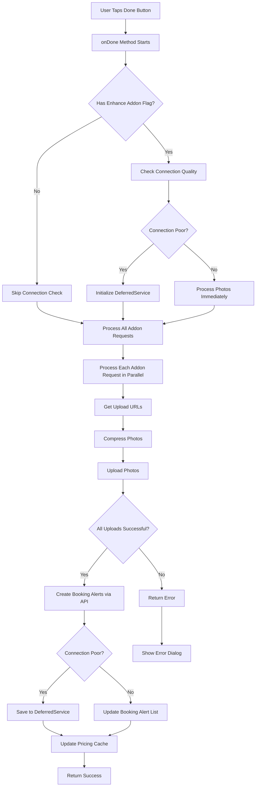
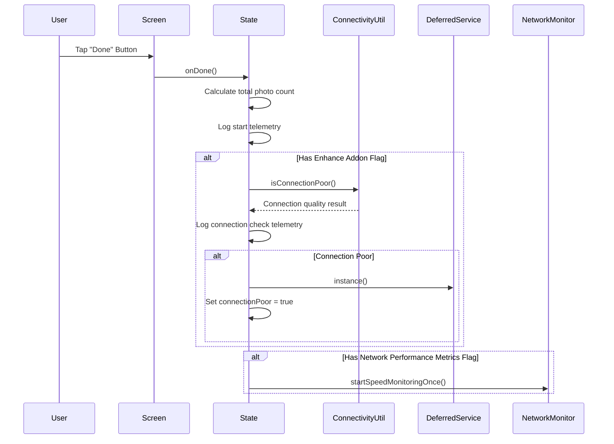
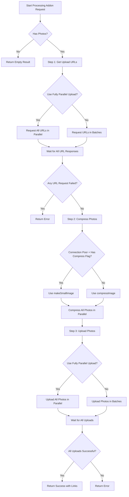
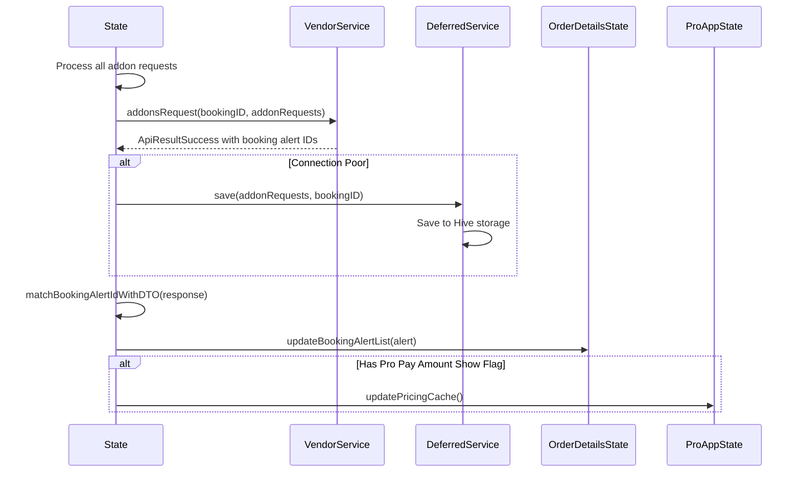
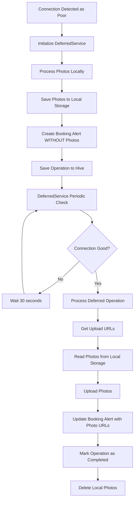

# Add-on Creation Process - Technical Documentation

## Overview

This document provides a comprehensive technical overview of the add-on creation process in the Pro App, including flow diagrams, telemetry details, feature flags, and connection handling mechanisms.

## Entry Point

**Screen:** `lib/screens/request_addon_bundled/request_addon_screen.dart`  
**State Management:** `lib/screens/request_addon_bundled/request_addon_screen_state.dart`  
**Trigger:** User taps "Done" button → `onButtonDoneTap()` → `RequestAddonScreenState.onDone()`

## Feature Flags

The following feature flags control add-on creation behavior:

| Feature Flag | Key | Description |
|--------------|-----|-------------|
| **Enhance Addon Creation** | `41318-enhance-addon-creation-in-pro-app-for-robustness-on-low-connectivity-or-intermittent-networks` | Enables connection quality checking and deferred uploads |
| **Network Performance Metrics** | `41653-network-performance-metrics` | Enables network speed monitoring and telemetry |
| **Pro Pay Amount Show** | `39860-show-payout-amounts-for-services-and-addons-in-pro-app` | Shows payout amounts for addons |

**Note:** All three flags are currently open for all users.

## High-Level Flow Diagram



## Detailed Process Flow

### 1. Initialization Phase



### 2. Photo Processing Flow



### 3. Photo Upload Steps (Detailed)

#### Step 1: Get Upload URLs

**Method:** `_processPhotos()` → `_vendorService.getUploadUrl()`

**Process:**
- **Fully Parallel Mode:** All URL requests sent simultaneously
- **Batched Mode:** Requests sent in batches of `maxConcurrentUploads` (default: 2)

**Telemetry Logs:**
```
RequestAddonScreenState _processPhotos: Step 1 - Getting upload URLs for N photos
RequestAddonScreenState _processPhotos: Requesting upload URL 1/N - filename: photo1.jpg
RequestAddonScreenState _processPhotos: getUploadUrl for N photos took Xms
```

**Failure Handling:**
- If any URL request fails, entire process fails
- Error logged to telemetry with failure count

#### Step 2: Compress Photos

**Methods:**
- `_imageService.compressImage()` - Standard compression (max 1920x1920, quality 85)
- `_imageService.makeSmallImage()` - Aggressive compression for poor connections (max 1000x1000, quality 60)

**Decision Logic:**
```dart
connectionPoor.value && hasImageCompressFlag 
    ? makeSmallImage() 
    : compressImage()
```

**Telemetry Logs:**
```
RequestAddonScreenState _processPhotos: Step 2 - Compressing N photos
RequestAddonScreenState _processPhotos: Compressing photo 1/N - original size: X KB
RequestAddonScreenState _processPhotos: Photo 1 compressed - original: X KB, compressed: Y KB, ratio: Z%
RequestAddonScreenState _processPhotos: compressImage for N photos took Xms
```

#### Step 3: Upload Photos

**Method:** `_imageService.putBlobImage()`

**Process:**
- **Fully Parallel Mode:** All uploads start simultaneously
- **Batched Mode:** Uploads processed in batches of `maxConcurrentUploads`

**Per-Photo Logging:**
- Start: Logs photo index, size, filename
- Completion: Logs success
- Error: Logs error details with stack trace

**Telemetry Logs:**
```
RequestAddonScreenState _processPhotos: Step 3 - Uploading N photos
RequestAddonScreenState _processPhotos: Starting upload 1/N - size: X KB, filename: photo1.jpg
RequestAddonScreenState _processPhotos: Completed upload 1/N - filename: photo1.jpg
RequestAddonScreenState _processPhotos: putBlobImage for N photos took Xms
```

### 4. Booking Alert Creation Flow



### 5. Deferred Service Flow (When Connection is Poor)



**DeferredService Details:**
- **Check Interval:** Every 30 seconds
- **Max Concurrent Operations:** 2
- **Max Retry Attempts:** 50
- **Backoff Strategy:** Exponential (2 * 2^retryCount seconds)

## Telemetry Events

### Custom Events

| Event Name | Description | Properties |
|------------|-------------|------------|
| `DynamicForm:TaskReceived` | When tasks are received | `workOrderId`, `taskIds` |
| `DynamicForm:SaveChecklist` | When checklist is saved | `workOrderId`, `taskId` |
| `DynamicForm:SaveTask` | When task is saved | `workOrderId`, `taskId` |
| `Connectivity:PeriodicNetworkMonitoring` | Network quality monitoring | `httpConnectionQuality`, `pingConnectionQuality`, `balancedQuality` |

### Trace Logs

All major operations log trace events with the following pattern:

```
RequestAddonScreenState:onDone: Starting - N addon requests, M total photos
RequestAddonScreenState:onDone: Connection quality check - connectionPoor: true/false
RequestAddonScreenState _processAddonRequest: Starting - ProductID: X, Photos: N
RequestAddonScreenState _processPhotos: Starting photo processing - N photos
RequestAddonScreenState _processPhotos: Step 1 - Getting upload URLs
RequestAddonScreenState _processPhotos: Step 2 - Compressing photos
RequestAddonScreenState _processPhotos: Step 3 - Uploading photos
RequestAddonScreenState:onDone: Creating booking alerts - BookingID: X, WorkOrderID: Y
RequestAddonScreenState:onDone: Total operation time Xms
```

### Error Logs

Errors are logged with severity `Severity.error` and include:
- Error message
- Stack trace (where applicable)
- Context (ProductID, photo count, etc.)

## Connection Quality Detection

**Method:** `ConnectivityUtil.connectivityInformation()`

**Metrics Evaluated:**
1. **HTTP Connection Quality:** Based on HTTP request latency
2. **Ping Connection Quality:** Based on ICMP ping latency
3. **Balanced Quality:** Combined assessment

**Quality Levels:**
- `Good` - Connection is reliable
- `Moderate` - Connection may be slow but usable
- `Poor` - Connection is unreliable, use deferred uploads

**Decision Logic:**
```dart
if (hasEnhanceAddonFlag) {
    connectionPoor.value = await isConnectionPoor();
    if (connectionPoor.value) {
        deferredService = DeferredService.instance();
    }
}
```

## Photo Upload Strategies

### Fully Parallel Upload

**When Used:** When `imageUploadImprovement` feature flag is **NOT** active

**Behavior:**
- All upload URL requests sent simultaneously
- All photo uploads start simultaneously
- Maximum throughput but may cause network congestion

### Batched Upload

**When Used:** When `imageUploadImprovement` feature flag **IS** active

**Behavior:**
- Upload URL requests batched (default: 2 concurrent)
- Photo uploads batched (default: 2 concurrent)
- Reduces network congestion
- More predictable performance

**Configuration:**
```dart
static const int maxConcurrentUploads = 2;
bool get useFullyParallelUpload => 
    !(Get.find<FeatureFlagService>().userActiveKey.contains(FeatureFlagKeys.imageUploadImprovement));
```

## Error Handling

### Photo Upload Failures

1. **Upload URL Request Failure:**
   - Logged with error severity
   - Process stops, returns `null`
   - User sees error dialog

2. **Photo Compression Failure:**
   - Falls back to original image
   - Process continues
   - Logged as warning

3. **Photo Upload Failure:**
   - Logged per-photo with error details
   - Entire process fails if any upload fails
   - User sees error dialog with retry option

### API Failures

1. **addonsRequest API Failure:**
   - Logged with error severity
   - Process stops
   - User sees error dialog

2. **Booking Alert Creation Failure:**
   - Logged with error severity
   - Process stops
   - User sees error dialog

## Performance Metrics

### Logged Metrics

- **Total Operation Time:** From `onDone()` start to completion
- **Photo Processing Time:** Per addon request
- **Upload URL Retrieval Time:** Per batch/all photos
- **Compression Time:** Per batch/all photos
- **Upload Time:** Per batch/all photos
- **API Call Duration:** Booking alert creation

### Example Telemetry Output

```
RequestAddonScreenState:onDone: Starting - 2 addon requests, 5 total photos
RequestAddonScreenState:onDone: Connection quality check - connectionPoor: false
RequestAddonScreenState _processAddonRequest: Starting - ProductID: abc-123, Photos: 3
RequestAddonScreenState _processPhotos: Step 1 - Getting upload URLs for 3 photos
RequestAddonScreenState _processPhotos: getUploadUrl for 3 photos took 450ms
RequestAddonScreenState _processPhotos: Step 2 - Compressing 3 photos
RequestAddonScreenState _processPhotos: compressImage for 3 photos took 1200ms
RequestAddonScreenState _processPhotos: Step 3 - Uploading 3 photos
RequestAddonScreenState _processPhotos: putBlobImage for 3 photos took 3500ms
RequestAddonScreenState:onDone: Processing 2 addon requests took 5200ms
RequestAddonScreenState:onDone: addonsRequest API call took 380ms
RequestAddonScreenState:onDone: Total operation time 5600ms
```

## Key Files and Methods

| File | Key Methods | Purpose |
|------|-------------|---------|
| `request_addon_screen.dart` | `onButtonDoneTap()` | Entry point, UI handling |
| `request_addon_screen_state.dart` | `onDone()` | Main orchestration |
| `request_addon_screen_state.dart` | `_processAddonRequest()` | Process single addon |
| `request_addon_screen_state.dart` | `_processPhotos()` | Photo upload pipeline |
| `deferred_service.dart` | `save()` | Save deferred operations |
| `deferred_service.dart` | `processSingleOperation()` | Process deferred uploads |
| `image_service.dart` | `putBlobImage()` | Upload photo to blob storage |
| `vendors_service.dart` | `addonsRequest()` | Create booking alerts via API |
| `connectivity_util.dart` | `connectivityInformation()` | Check connection quality |

## Summary

The add-on creation process is designed to handle both good and poor network conditions:

1. **Good Connection:** Photos uploaded immediately, booking alerts created with photo attachments
2. **Poor Connection:** Photos saved locally, booking alerts created without photos, photos uploaded later via DeferredService

The system includes comprehensive telemetry logging at every step, allowing for detailed analysis of performance and failure points. Feature flags control upload strategies and connection handling, providing flexibility for A/B testing and gradual rollouts.
