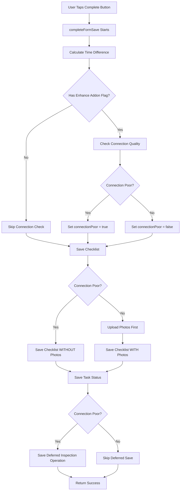
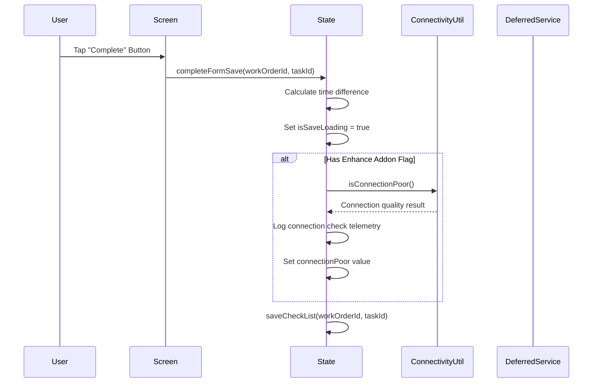
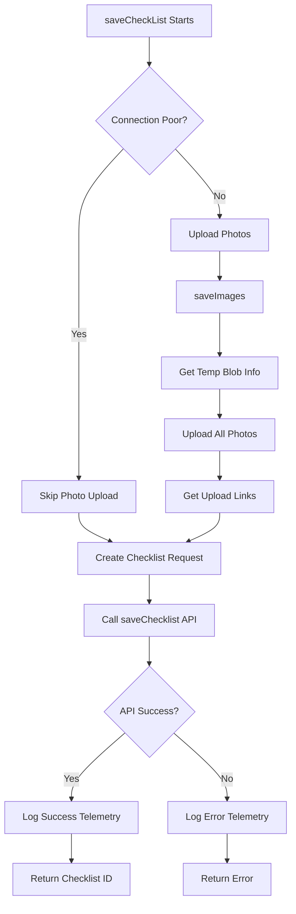
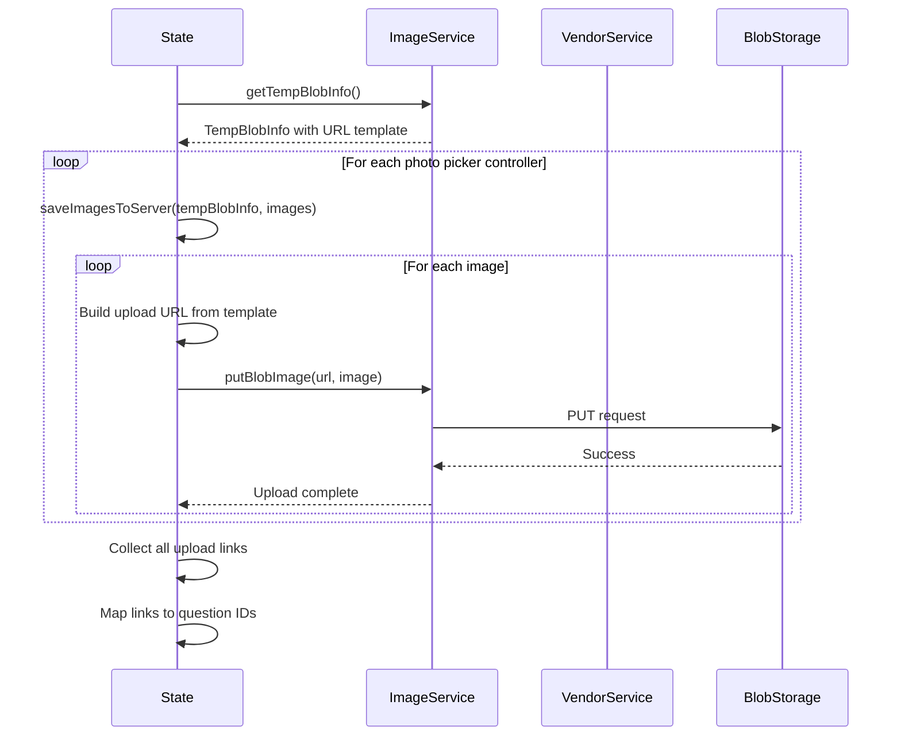
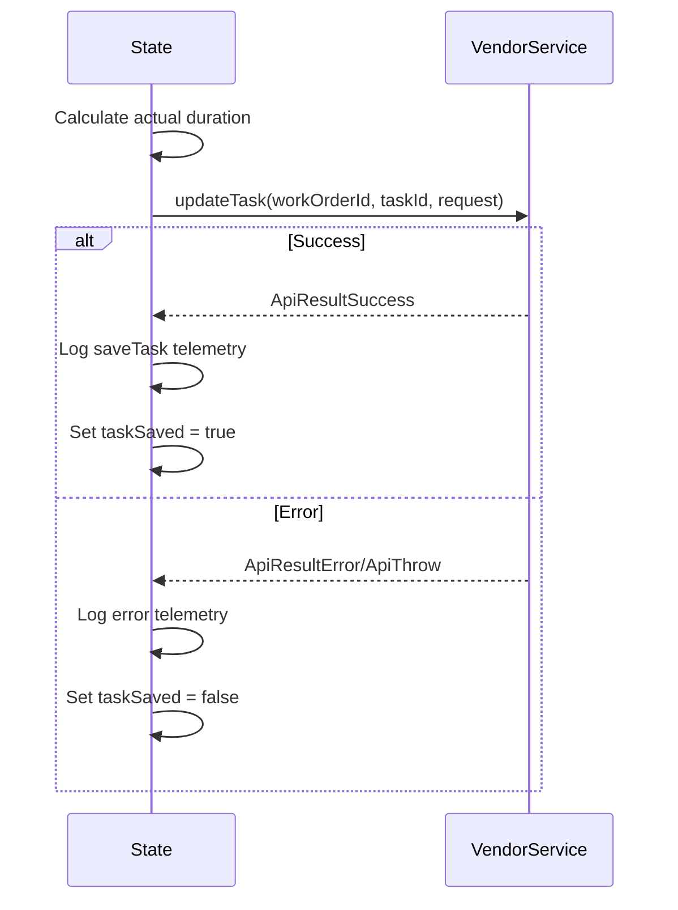
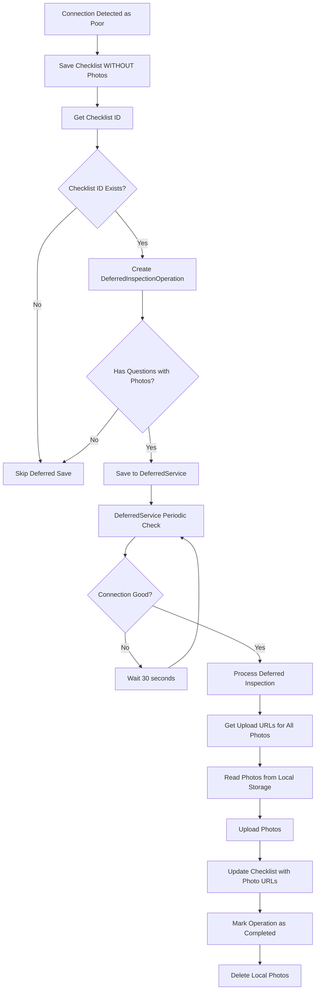
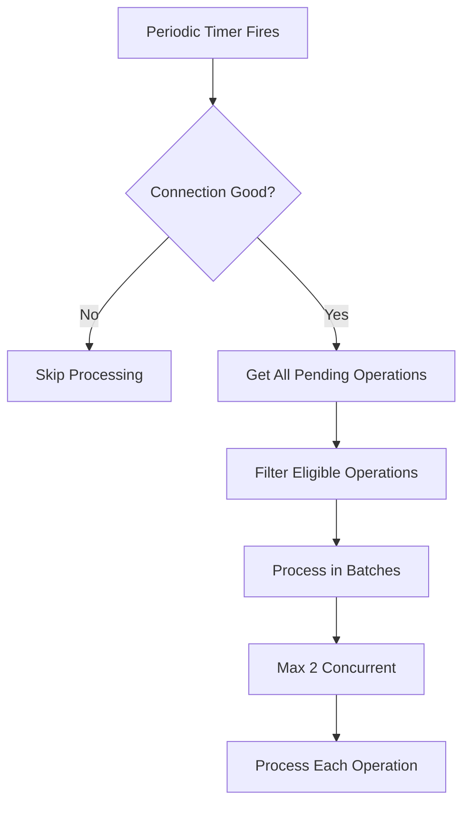

# Checklist/Task Completion Process - Technical Documentation

## Overview

This document provides a comprehensive technical overview of the checklist/task completion process in the Pro App, including flow diagrams, telemetry details, feature flags, and connection handling mechanisms.

## Entry Point

**Screen:** `lib/screens/dynamic_form/dynamic_form.dart`  
**State Management:** `lib/screens/dynamic_form/dynamic_form_state.dart`  
**Trigger:** User taps "Complete" button (`TestKeys.dynamicFormActiveCompleteButton`) → `DynamicFormState.completeFormSave()`

## Feature Flags

The following feature flag controls checklist completion behavior:

| Feature Flag | Key | Description |
|--------------|-----|-------------|
| **Enhance Addon Creation** | `41318-enhance-addon-creation-in-pro-app-for-robustness-on-low-connectivity-or-intermittent-networks` | Enables connection quality checking and deferred uploads for checklists |

**Note:** This flag is shared with addon creation functionality.

## High-Level Flow Diagram



## Detailed Process Flow

### 1. Initialization Phase



### 2. Checklist Save Flow



### 3. Photo Upload Flow (When Connection is Good)



### 4. Task Status Update Flow



### 5. Deferred Inspection Flow (When Connection is Poor)



## Detailed Process Steps

### Step 1: Connection Quality Check

**Method:** `DynamicFormState.isConnectionPoor()`

**Process:**
```dart
if (hasEnhanceAddonFlag) {
    connectionPoor.value = await isConnectionPoor();
}
```

**Telemetry Log:**
```
DynamicFormState isConnectionPoor: Connectivity quality {Good|Moderate|Poor}
```

### Step 2: Save Checklist

**Method:** `DynamicFormState.saveCheckList()`

**Process:**
1. **If Connection Good:**
   - Call `saveImages()` to upload photos
   - Get upload links mapped to question IDs
   - Include upload links in checklist request

2. **If Connection Poor:**
   - Skip photo upload
   - Create checklist request without photo attachments
   - Photos will be uploaded later via DeferredService

**Checklist Request Structure:**
```dart
ChecklistRequest {
    title: String,
    description: String,
    pages: [
        ChecklistPageRequest {
            name: String,
            description: String,
            title: String,
            elements: [
                ChecklistRequestElement {
                    questionId: String,
                    value: String | List<String>,
                    uploadedAttachments: [
                        UploadAttachment {
                            uri: String,
                            filename: String
                        }
                    ]
                }
            ]
        }
    ]
}
```

**Telemetry Events:**
- **Success:** `DynamicFormInteraction.saveChecklist` with `workOrderId` and `taskId`
- **Error:** `DynamicFormState:saveCheckList:error` with error details

### Step 3: Upload Photos (Connection Good Path)

**Method:** `DynamicFormState.saveImages()`

**Sub-steps:**

#### 3.1 Get Temp Blob Info
```dart
var tempBlobInfo = await _imageService.getTempBlobInfo();
```

**Telemetry Log:**
```
DynamicFormState saveImages: getTempBlobInfo took Xms
```

#### 3.2 Upload Photos to Server
```dart
for (var controller in filledPickerController) {
    await saveImagesToServer(tempBlobInfo, controller.value.allImages);
}
```

**Per-Photo Upload:**
```dart
final url = tempBlobInfo.createUrlTemplate.replaceAll('{BLOBNAME}', element.name);
await _imageService.putBlobImage((p0) => {}, url, element.image);
```

**Telemetry Logs:**
```
DynamicFormState saveImages: putBlobImage for N photos took Xms
DynamicFormState saveImages: Total processing time Xms for N photos
```

### Step 4: Save Task Status

**Method:** `DynamicFormState.saveTask()`

**Request Structure:**
```dart
ServiceTaskRequest {
    status: ServiceTaskStatus.completed,
    actualDuration: int, // minutes
    percentComplete: 100
}
```

**Telemetry Events:**
- **Success:** `DynamicFormInteraction.saveTask` with `workOrderId` and `taskId`
- **Error:** `DynamicFormState:saveTask:error` with error details

### Step 5: Save Deferred Inspection (Connection Poor Path)

**Method:** `DynamicFormState.saveDeferredInspection()`

**Process:**
```dart
if (!connectionPoor.isTrue) return; // Skip if connection is good
if (checklistId == null) return; // Skip if checklist wasn't saved

var deferredInspectionOperation = DeferredInspectionOperation.fromRequestAddonDTO(
    workOrderId,
    taskId,
    checklistId,
    pickerControllerDto,
);

if (deferredInspectionOperation.questions.isEmpty) return; // Skip if no photos

await DeferredService.instance().saveInspection(deferredInspectionOperation);
```

**DeferredInspectionOperation Structure:**
```dart
DeferredInspectionOperation {
    workOrderId: String,
    serviceTaskId: String,
    checklistId: String,
    questions: [
        {
            questionId: String,
            localImagePaths: List<String>,
            filenames: List<String>
        }
    ],
    status: OperationStatus.pending,
    retryCount: 0,
    createdAt: DateTime,
    lastAttemptTimestamp: DateTime?
}
```

## Deferred Service Processing

### Periodic Check

**Interval:** Every 30 seconds  
**Method:** `DeferredService._startPeriodicCheck()`

**Process:**


### Processing Deferred Inspection Operation

**Method:** `DeferredService.processSingleInspectionOperation()`

**Steps:**
1. **Check if Already Processing:**
   ```dart
   if (progressStartedOperationIds.contains(operation.checklistId)) return;
   ```

2. **Get Upload URLs:**
   ```dart
   Map<String, List<String>> inspectionImages = {};
   for (var question in operation.questions) {
       var uploadUrls = await getAllUploadUrl(question.localImagePaths, question.filenames);
       inspectionImages[question.questionId] = uploadUrls;
   }
   ```

3. **Update Checklist:**
   ```dart
   await updateChecklist(operation, inspectionImages, processStartTime, photoCount);
   ```

4. **Mark as Completed:**
   ```dart
   await updateInspectionStatusAsCompleted(operation);
   ```

**Telemetry Logs:**
```
DeferredService processSingleInspectionOperation: Starting deferred upload for checklist {checklistId}
DeferredService getAllUploadUrl: Photo files not found for path {path}
DeferredService getAllUploadUrl: Failed to get upload URL for {filename}
DeferredService updateChecklist: saveImages: Total processing time Xms for N photos (deferred upload completed)
```

### Upload URL Retrieval (Deferred)

**Method:** `DeferredService.getAllUploadUrl()`

**Process:**
```dart
for (var i = 0; i < localImagePaths.length; i++) {
    final imagePath = localImagePaths[i];
    final imageExist = await _fileStorage.fileExists(imagePath);
    
    if (imageExist) {
        final imageBytes = await _fileStorage.readImage(imagePath);
        final uploadUrl = await _getUploadUrl(filenames[i]);
        uploadUrls.insert(i, uploadUrl);
        await _uploadImage(uploadUrl, imageBytes);
    }
}
```

**Error Handling:**
- If file doesn't exist: Log warning, skip photo
- If upload URL fails: Log error, throw exception
- If upload fails: Log error, throw exception

### Checklist Update (Deferred)

**Method:** `DeferredService.updateChecklist()`

**Request Structure:**
```dart
ChecklistUpdateRequestModel {
    checklistId: String,
    elements: [
        ChecklistUpdateRequestElementModel {
            questionId: String,
            uploadedAttachments: [
                {
                    "uri": String,
                    "filename": String
                }
            ]
        }
    ]
}
```

**API Call:**
```dart
await _vendorService.updateChecklistTask(
    operation.workOrderId,
    operation.serviceTaskId,
    checklistRequest.toJson()
);
```

## Telemetry Events

### Custom Events

| Event Name | Description | Properties |
|------------|-------------|------------|
| `DynamicForm:TaskReceived` | When tasks are received | `workOrderId`, `taskIds` |
| `DynamicForm:SaveChecklist` | When checklist is saved | `workOrderId`, `taskId` |
| `DynamicForm:SaveTask` | When task is saved | `workOrderId`, `taskId` |
| `Connectivity:PeriodicNetworkMonitoring` | Network quality monitoring | `httpConnectionQuality`, `pingConnectionQuality`, `balancedQuality` |

### Trace Logs

**Checklist Completion:**
```
DynamicFormState:completeFormSave: Total operation time Xms
DynamicFormState isConnectionPoor: Connectivity quality {Good|Moderate|Poor}
DynamicFormState saveImages: getTempBlobInfo took Xms
DynamicFormState saveImages: putBlobImage for N photos took Xms
DynamicFormState saveImages: Total processing time Xms for N photos
```

**Deferred Upload:**
```
DeferredService processSingleInspectionOperation: Starting deferred upload for checklist {checklistId}
DeferredService getAllUploadUrl: Starting upload URL retrieval for N photos
DeferredService getAllUploadUrl: Upload summary - Total: N, Successful: M, Failed: K
DeferredService updateChecklist: saveImages: Total processing time Xms for N photos (deferred upload completed)
```

### Error Logs

**Checklist Save Errors:**
```
DynamicFormState:saveCheckList:error
Properties: {error: String, workOrderId: String, taskId: String}
```

**Task Save Errors:**
```
DynamicFormState:saveTask:error
Properties: {error: String, workOrderId: String, taskId: String}
```

**Deferred Upload Errors:**
```
DeferredService processSingleInspectionOperation: Error processing operation: {error}
DeferredService getAllUploadUrl: Failed to get upload URL for {filename}: {error}
DeferredService updateChecklist: Failed to update checklist: {error}
```

## Connection Quality Detection

**Method:** `ConnectivityUtil.connectivityInformation()`

**Same as Add-on Creation Process:**
- Evaluates HTTP connection quality
- Evaluates ping connection quality
- Provides balanced quality assessment

**Decision Logic:**
```dart
if (hasEnhanceAddonFlag) {
    connectionPoor.value = await isConnectionPoor();
    
    if (connectionPoor.isTrue) {
        // Skip photo upload, save to deferred service
        saveLink = <String, List<(String, String)>>{};
    } else {
        // Upload photos immediately
        saveLink = await saveImages();
    }
}
```

## Photo Storage and Retrieval

### Local Storage (Deferred Path)

**Storage Service:** `FileStorageService`

**Save Process:**
- Photos saved when user selects them
- Stored in app's local file system
- Paths stored in `DeferredInspectionOperation`

**Retrieval Process:**
- Read from local storage when connection improves
- Verify file exists before reading
- Read as `Uint8List` for upload

**Cleanup:**
- Local photos deleted after successful upload
- Failed operations retain photos for retry

## Error Handling

### Checklist Save Failures

1. **Photo Upload Failure (Good Connection):**
   - Process stops
   - Error logged
   - User sees error, can retry

2. **Checklist API Failure:**
   - Error logged with context
   - Process stops
   - User sees error

### Task Save Failures

1. **Task Update API Failure:**
   - Error logged
   - Process stops
   - User sees error

### Deferred Upload Failures

1. **File Not Found:**
   - Logged as warning
   - Photo skipped
   - Process continues

2. **Upload URL Failure:**
   - Logged as error
   - Operation retried with backoff
   - Max 50 retry attempts

3. **Photo Upload Failure:**
   - Logged as error
   - Operation retried with backoff
   - Max 50 retry attempts

4. **Checklist Update Failure:**
   - Logged as error
   - Operation retried with backoff
   - Max 50 retry attempts

## Performance Metrics

### Logged Metrics

- **Total Operation Time:** From `completeFormSave()` start to completion
- **Checklist Save Time:** API call duration
- **Photo Upload Time:** Total time for all photos
- **Temp Blob Info Time:** Time to get upload URLs
- **Task Update Time:** API call duration
- **Deferred Upload Time:** Time to process deferred operation

### Example Telemetry Output

**Good Connection:**
```
DynamicFormState:completeFormSave: Total operation time 8500ms
DynamicFormState isConnectionPoor: Connectivity quality Good
DynamicFormState saveImages: getTempBlobInfo took 450ms
DynamicFormState saveImages: putBlobImage for 5 photos took 3200ms
DynamicFormState saveImages: Total processing time 3650ms for 5 photos
```

**Poor Connection:**
```
DynamicFormState:completeFormSave: Total operation time 1200ms
DynamicFormState isConnectionPoor: Connectivity quality Poor
DeferredService processSingleInspectionOperation: Starting deferred upload for checklist abc-123
DeferredService getAllUploadUrl: Starting upload URL retrieval for 5 photos
DeferredService updateChecklist: saveImages: Total processing time 4500ms for 5 photos (deferred upload completed)
```

## Key Files and Methods

| File | Key Methods | Purpose |
|------|-------------|---------|
| `dynamic_form.dart` | `completeFormSave()` handler | Entry point, UI handling |
| `dynamic_form_state.dart` | `completeFormSave()` | Main orchestration |
| `dynamic_form_state.dart` | `saveCheckList()` | Save checklist with/without photos |
| `dynamic_form_state.dart` | `saveImages()` | Upload photos (good connection) |
| `dynamic_form_state.dart` | `saveTask()` | Update task status |
| `dynamic_form_state.dart` | `saveDeferredInspection()` | Save deferred operation |
| `deferred_service.dart` | `saveInspection()` | Save deferred inspection to storage |
| `deferred_service.dart` | `processSingleInspectionOperation()` | Process deferred uploads |
| `deferred_service.dart` | `updateChecklist()` | Update checklist with photo URLs |
| `image_service.dart` | `getTempBlobInfo()` | Get blob storage URL template |
| `image_service.dart` | `putBlobImage()` | Upload photo to blob storage |
| `vendors_service.dart` | `saveChecklist()` | Create checklist via API |
| `vendors_service.dart` | `updateChecklistTask()` | Update checklist with photos |
| `vendors_service.dart` | `updateTask()` | Update task status |

## Summary

The checklist completion process handles both good and poor network conditions:

1. **Good Connection:**
   - Photos uploaded immediately
   - Checklist saved with photo attachments
   - Task status updated
   - Process completes synchronously

2. **Poor Connection:**
   - Checklist saved without photos
   - Task status updated
   - Photos saved to local storage
   - Deferred operation created
   - Photos uploaded later via DeferredService when connection improves
   - Checklist updated with photo URLs

The system includes comprehensive telemetry logging at every step, allowing for detailed analysis of performance and failure points. The deferred service ensures photos are eventually uploaded even if the connection is poor at the time of completion.
